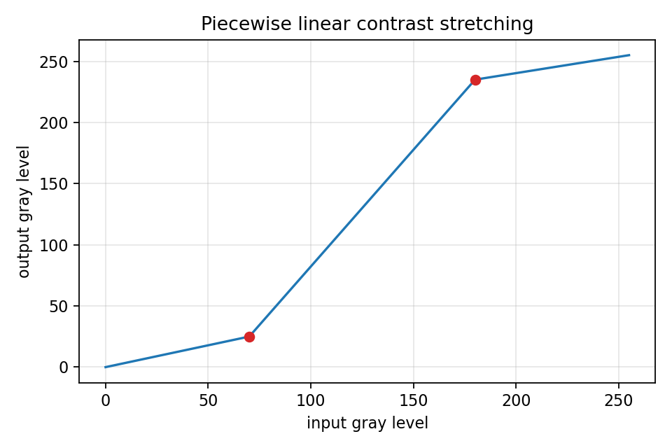

# 2.2_对比度线性展宽

> [!note] 书中对应页
> PDF 页码：37-38
> 打开原页（Obsidian）：[[raw/books/数字图像处理基础_朱虹.pdf#page=37]]
>
> GitHub 公开仓库不随附原书 PDF；下载仓库后，将有权使用的同名 PDF 放入 `raw/books/`，下面的 Obsidian 本地内嵌预览才会显示。
> ![[raw/books/数字图像处理基础_朱虹.pdf#page=37]]

## 核心概念

对比度线性展宽通过分段线性函数把输入灰度区间拉伸到更大的输出区间，使目标灰度范围占用更多显示动态范围。

## 关键公式

```math
s=\begin{cases}0,&r\le a\\ \frac{r-a}{b-a}(L-1),&a<r<b\\ L-1,&r\ge b\end{cases}
```

公式中的符号按通用数字图像处理记号整理；与原书具体编号、边界取值或变量命名不一致处，后续逐页核对时标注“需人工复核”。

## 算法步骤

1. 估计有效灰度下限 a 和上限 b。
2. 建立分段线性映射，低于 a 的值压到黑，高于 b 的值压到白。
3. 对所有像素映射并裁剪到合法范围。
4. 用直方图确认有效灰度是否被拉开。

## 直观理解

像把挤在中间的一段灰度拉满整个显示标尺。

## 使用场景

低对比度扫描件、雾化图像、灰度范围窄但噪声不严重的图像。

## 优点

可解释、可控、速度快，适合做增强流水线的基线。

## 局限性

端点选择敏感；若噪声处在端点附近，噪声也会被放大。

## 和其他增强方法的对比

比动态范围自动拉伸更依赖人工端点；比直方图均衡化更保留原有灰度次序和整体观感。

## 教学图示



该图为本仓库生成的原创教学示意图，不是原书截图；用于公开仓库展示和复习。

## 对应代码

- [examples/02_image_enhancement/contrast_stretching.py](../../examples/02_image_enhancement/contrast_stretching.py)

## 相关知识

- [[2.1_γ校正]]
- [[2.3_灰级窗与灰级窗切片]]
- [[2.3.1_灰级窗]]

## 复习问题

1. 端点 a、b 选得太靠内会发生什么？
2. 线性展宽为什么可能放大噪声？
3. 它和灰级窗的目标区域有什么不同？