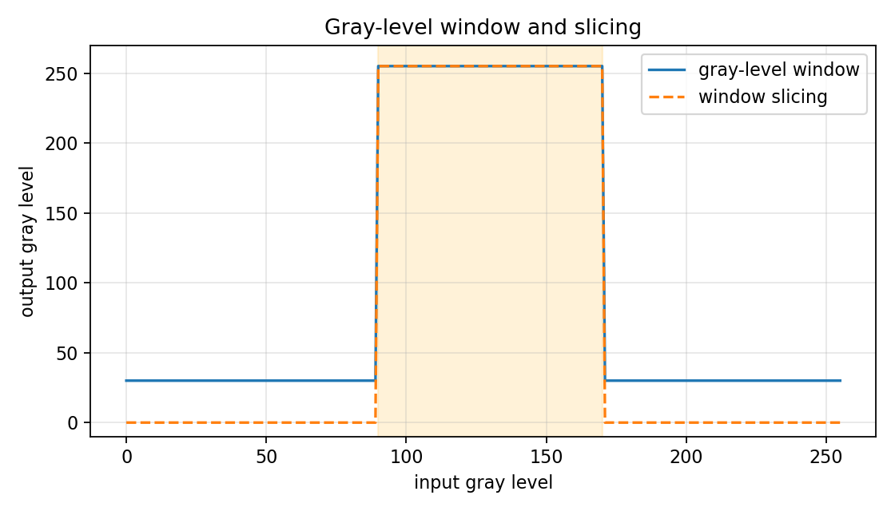

# 2.3.1_灰级窗

> [!note] 书中对应页
> PDF 页码：39
> 打开原页（Obsidian）：[[raw/books/数字图像处理基础_朱虹.pdf#page=39]]
>
> GitHub 公开仓库不随附原书 PDF；下载仓库后，将有权使用的同名 PDF 放入 `raw/books/`，下面的 Obsidian 本地内嵌预览才会显示。
> ![[raw/books/数字图像处理基础_朱虹.pdf#page=39]]

## 来源与状态

* 书名：数字图像处理基础
* 作者：朱虹
* 章节：第 2 章 图像增强
* 小节：2.3.1 灰级窗
* 书中页码：24
* PDF 页码：39
* 本地 PDF：raw/books/数字图像处理基础_朱虹.pdf
* 处理状态：已精修 / 需人工复核

## 核心概念

灰级窗是在指定灰度范围内进行细节观察的窗口化显示方法，常由窗宽和窗位描述。

## 关键公式

```math
center=\frac{a+b}{2},\quad width=b-a
```

公式中的符号按通用数字图像处理记号整理；与原书具体编号、边界取值或变量命名不一致处，后续逐页核对时标注“需人工复核”。

## 算法步骤

1. 确定窗位中心和窗宽。
2. 把窗口内灰度映射到可见范围。
3. 对窗口外灰度执行饱和或压缩。
4. 根据视觉目标迭代调整窗宽窗位。

## 直观理解

窗宽越窄，局部对比越强但可见范围越小。

## 使用场景

CT/MRI 灰度观察、工业无损检测的局部灰度检查。

## 优点

对特定灰度组织或材料非常直观。

## 局限性

不同窗口之间的信息不能一次性全部呈现。

## 和其他增强方法的对比

与γ校正相比，灰级窗强调区间选择；与线性展宽相比，它通常接受窗口外饱和。

## 教学图示



该图为本仓库生成的原创教学示意图，不是原书截图；用于公开仓库展示和复习。

## 对应代码

- [examples/02_image_enhancement/gray_level_window.py](../../examples/02_image_enhancement/gray_level_window.py)

## 相关知识

- [[2.2_对比度线性展宽]]
- [[2.3_灰级窗与灰级窗切片]]
- [[2.3.2_灰级窗切片]]
- [[2.4_动态范围调整]]

## 复习问题

1. 窗宽变窄会带来什么视觉变化？
2. 窗位移动对应观察哪类灰度？
3. 为什么一个图像可能需要多个窗位？
