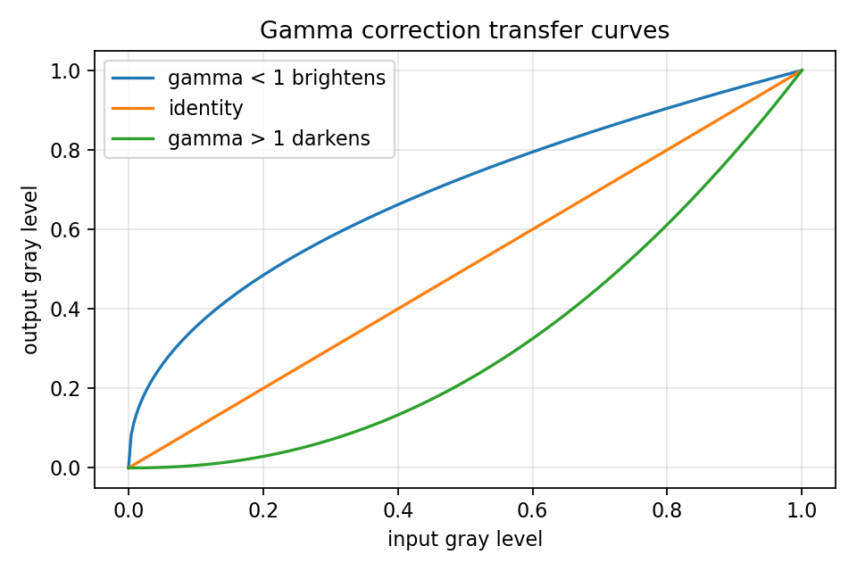

# 2.4.2_非线性动态范围调整

> [!note] 书中对应页
> PDF 页码：44
> 打开原页（Obsidian）：[[raw/books/数字图像处理基础_朱虹.pdf#page=44]]
>
> GitHub 公开仓库不随附原书 PDF；下载仓库后，将有权使用的同名 PDF 放入 `raw/books/`，下面的 Obsidian 本地内嵌预览才会显示。
> ![[raw/books/数字图像处理基础_朱虹.pdf#page=44]]

## 来源与状态

* 书名：数字图像处理基础
* 作者：朱虹
* 章节：第 2 章 图像增强
* 小节：2.4.2 非线性动态范围调整
* 书中页码：29
* PDF 页码：44
* 本地 PDF：raw/books/数字图像处理基础_朱虹.pdf
* 处理状态：已精修 / 需人工复核

## 核心概念

非线性动态范围调整用对数、指数、幂律等曲线，对不同灰度段给出不同增强力度。

## 关键公式

```math
s=c\log(1+r)\quad\text{或}\quad s=c r^\gamma
```

公式中的符号按通用数字图像处理记号整理；与原书具体编号、边界取值或变量命名不一致处，后续逐页核对时标注“需人工复核”。

## 算法步骤

1. 判断需要突出暗部、亮部还是压缩高动态范围。
2. 选择对数、指数或幂律函数。
3. 归一化输入并执行映射。
4. 结合直方图和视觉结果调整参数。

## 直观理解

非线性映射像弯曲灰度尺，让某些区间拥有更多刻度。

## 使用场景

暗部细节增强、频谱图显示、强光区域动态压缩。

## 优点

能更贴合人眼或任务对不同亮度段的关注。

## 局限性

参数不当会造成层次挤压或灰度断裂。

## 和其他增强方法的对比

比线性调整灵活；比 Retinex 简单但不处理空间照明估计。

## 对应代码

- [examples/02_image_enhancement/gamma_correction.py](../../examples/02_image_enhancement/gamma_correction.py)

## 相关知识

- [[2.4_动态范围调整]]
- [[2.4.1_线性动态范围调整]]
- [[2.5_直方图均衡化]]
- [[2.6_自适应直方图均衡化]]

## 复习问题

1. 对数变换为什么常用于压缩大范围数值？
2. 非线性调整为何容易产生过增强？
3. 如何用直方图辅助调参？

## 教学图示



该图为本仓库原创教学示意图，不是原书截图。
