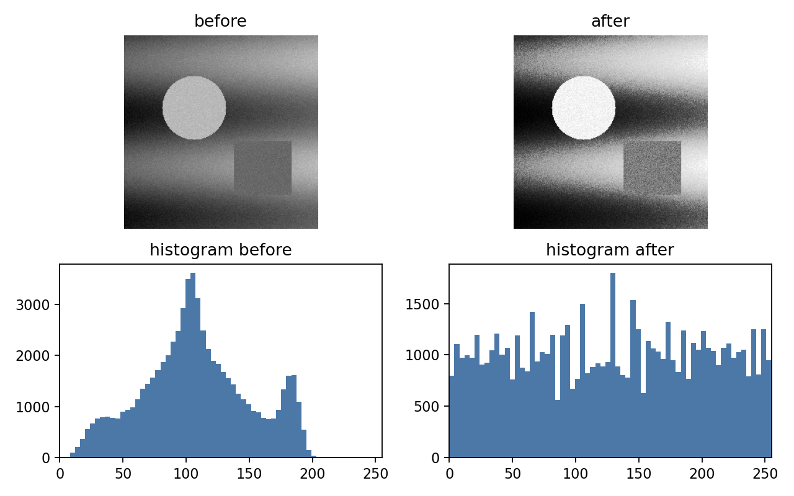

# 2.5_直方图均衡化

> [!note] 书中对应页
> PDF 页码：46-48
> 打开原页（Obsidian）：[[raw/books/数字图像处理基础_朱虹.pdf#page=46]]
>
> GitHub 公开仓库不随附原书 PDF；下载仓库后，将有权使用的同名 PDF 放入 `raw/books/`，下面的 Obsidian 本地内嵌预览才会显示。
> ![[raw/books/数字图像处理基础_朱虹.pdf#page=46]]

## 核心概念

直方图均衡化利用累计分布函数重新映射灰度，使输出灰度分布更接近均匀，从而提高整体对比度。

## 关键公式

```math
s_k=(L-1)\sum_{j=0}^{k}p_r(r_j)
```

公式中的符号按通用数字图像处理记号整理；与原书具体编号、边界取值或变量命名不一致处，后续逐页核对时标注“需人工复核”。

## 算法步骤

1. 统计灰度直方图。
2. 归一化得到概率分布。
3. 计算累计分布函数 CDF。
4. 用 CDF 建立查找表并映射所有像素。

## 直观理解

把出现过密的灰度段摊开，把过稀的灰度段合并。

## 使用场景

整体偏暗/偏亮且灰度集中图像的快速增强。

## 优点

自动化程度高，不需要手动选择端点。

## 局限性

可能放大噪声，局部区域可能过增强，亮度风格可能变化明显。

## 和其他增强方法的对比

比线性展宽更自适应；比 CLAHE 更全局，无法限制局部噪声放大。

## 教学图示



该图为本仓库生成的原创教学示意图，不是原书截图；用于公开仓库展示和复习。

## 对应代码

- [examples/02_image_enhancement/histogram_equalization.py](../../examples/02_image_enhancement/histogram_equalization.py)

## 相关知识

- [[2.4.1_线性动态范围调整]]
- [[2.4.2_非线性动态范围调整]]
- [[2.6_自适应直方图均衡化]]
- [[2.7_伪彩色]]

## 复习问题

1. CDF 为什么能作为灰度映射函数？
2. 均衡化后直方图一定完全平坦吗？
3. 什么时候直方图均衡化不适合直接使用？