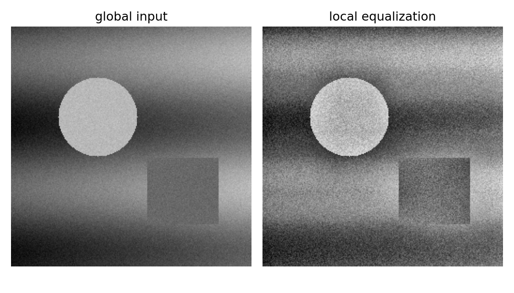

# 2.6_自适应直方图均衡化

> [!note] 书中对应页
> PDF 页码：49-50
> 打开原页（Obsidian）：[[raw/books/数字图像处理基础_朱虹.pdf#page=49]]
>
> GitHub 公开仓库不随附原书 PDF；下载仓库后，将有权使用的同名 PDF 放入 `raw/books/`，下面的 Obsidian 本地内嵌预览才会显示。
> ![[raw/books/数字图像处理基础_朱虹.pdf#page=49]]

## 核心概念

自适应直方图均衡化在局部窗口内执行均衡化，CLAHE 进一步用裁剪限制避免噪声被过度放大。

## 关键公式

```math
s(x,y)=T_{\Omega(x,y)}(r(x,y))
```

公式中的符号按通用数字图像处理记号整理；与原书具体编号、边界取值或变量命名不一致处，后续逐页核对时标注“需人工复核”。

## 算法步骤

1. 把图像划分为网格或局部窗口。
2. 在每个局部区域统计直方图。
3. 必要时裁剪直方图峰值并重新分配。
4. 插值融合相邻区域映射结果，避免块效应。

## 直观理解

不是给整张图一套增强规则，而是给每块区域一套更贴近局部的规则。

## 使用场景

医学图像、低照度图像、局部对比不足的纹理观察。

## 优点

局部细节增强明显，可配合裁剪限制噪声。

## 局限性

参数更多，计算量更大；窗口过小会产生块感或增强噪声。

## 和其他增强方法的对比

比全局均衡更重视局部；比 Retinex 更偏统计映射，不显式建模光照。

## 教学图示



该图为本仓库生成的原创教学示意图，不是原书截图；用于公开仓库展示和复习。

## 对应代码

- [examples/02_image_enhancement/adaptive_histogram_equalization.py](../../examples/02_image_enhancement/adaptive_histogram_equalization.py)

## 相关知识

- [[2.4.2_非线性动态范围调整]]
- [[2.5_直方图均衡化]]
- [[2.7_伪彩色]]
- [[2.8_Retinex图像增强方法]]

## 复习问题

1. CLAHE 中 clipLimit 的作用是什么？
2. 窗口大小如何影响增强效果？
3. 为什么需要区域间插值？