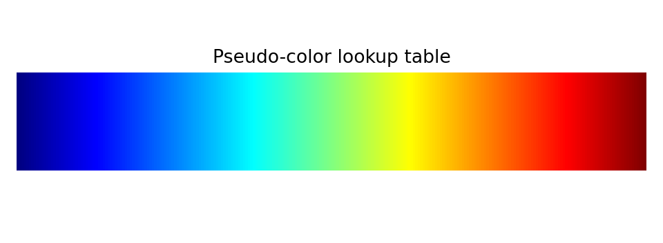

# 2.7_伪彩色

> [!note] 书中对应页
> PDF 页码：51-53
> 打开原页（Obsidian）：[[raw/books/数字图像处理基础_朱虹.pdf#page=51]]
>
> GitHub 公开仓库不随附原书 PDF；下载仓库后，将有权使用的同名 PDF 放入 `raw/books/`，下面的 Obsidian 本地内嵌预览才会显示。
> ![[raw/books/数字图像处理基础_朱虹.pdf#page=51]]

## 核心概念

伪彩色把单通道灰度映射为彩色，以利用人眼对颜色差异的敏感性突出灰度层次。

## 关键公式

```math
(R,G,B)=LUT(r)
```

公式中的符号按通用数字图像处理记号整理；与原书具体编号、边界取值或变量命名不一致处，后续逐页核对时标注“需人工复核”。

## 算法步骤

1. 选择色表或设计灰度到颜色的 LUT。
2. 把每个灰度值映射为 RGB。
3. 检查色表是否符合数值含义，避免误导。
4. 必要时保留颜色条解释映射。

## 直观理解

它不增加原始信息，而是把灰度差异换成人眼更容易分辨的颜色差异。

## 使用场景

热力图、遥感单波段显示、医学或工业强度场可视化。

## 优点

显示直观，能突出细微灰度层次。

## 局限性

色表选择可能制造虚假边界或误读强弱关系。

## 和其他增强方法的对比

不同于彩色图像处理，伪彩色输入通常仍是灰度；不同于灰级窗切片，它可连续映射全灰度范围。

## 教学图示



该图为本仓库生成的原创教学示意图，不是原书截图；用于公开仓库展示和复习。

## 对应代码

- [examples/02_image_enhancement/pseudo_color.py](../../examples/02_image_enhancement/pseudo_color.py)

## 相关知识

- [[2.5_直方图均衡化]]
- [[2.6_自适应直方图均衡化]]
- [[2.8_Retinex图像增强方法]]

## 复习问题

1. 伪彩色是否增加图像信息？
2. 为什么需要配色条？
3. 连续色表和分段色表适用场景有何不同？