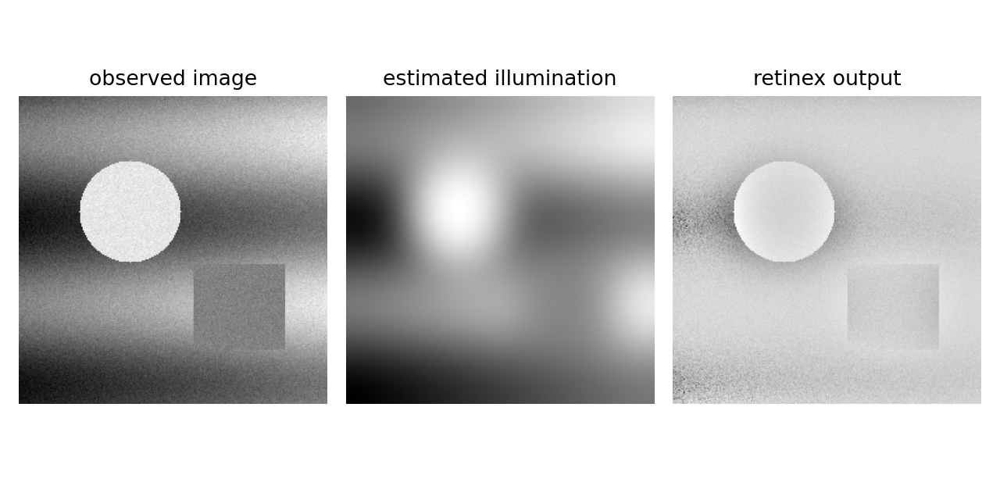

# 2.8_Retinex图像增强方法

> [!note] 书中对应页
> PDF 页码：54-55
> 打开原页（Obsidian）：[[raw/books/数字图像处理基础_朱虹.pdf#page=54]]
>
> GitHub 公开仓库不随附原书 PDF；下载仓库后，将有权使用的同名 PDF 放入 `raw/books/`，下面的 Obsidian 本地内嵌预览才会显示。
> ![[raw/books/数字图像处理基础_朱虹.pdf#page=54]]

## 核心概念

Retinex 将图像理解为照明与反射的组合，通过估计并削弱照明分量来增强反射细节和颜色恒常性。

## 关键公式

```math
R(x,y)=\log I(x,y)-\log(F(x,y)*I(x,y))
```

公式中的符号按通用数字图像处理记号整理；与原书具体编号、边界取值或变量命名不一致处，后续逐页核对时标注“需人工复核”。

## 算法步骤

1. 把输入转为浮点并避免零值。
2. 用高斯核等方法估计照明分量。
3. 在对数域相减得到反射近似。
4. 归一化或颜色恢复后输出增强图像。

## 直观理解

Retinex 试图区分“物体本来的反射特性”和“照在它上面的光”。

## 使用场景

不均匀照明、逆光、低照度、颜色恒常性增强。

## 优点

对局部照明变化更有针对性，能同时改善亮度和颜色观感。

## 局限性

尺度和参数敏感，可能产生光晕、颜色偏移或噪声增强。

## 和其他增强方法的对比

比γ校正、直方图均衡化更接近光照模型；比深度学习方法轻量但表达能力有限。

## 教学图示



该图为本仓库生成的原创教学示意图，不是原书截图；用于公开仓库展示和复习。

## 对应代码

- [examples/02_image_enhancement/retinex_enhancement.py](../../examples/02_image_enhancement/retinex_enhancement.py)

## 相关知识

- [[2.6_自适应直方图均衡化]]
- [[2.7_伪彩色]]

## 复习问题

1. Retinex 为什么常在对数域计算？
2. 高斯尺度大小会影响什么？
3. 它和 CLAHE 都能增强局部细节，核心差别是什么？