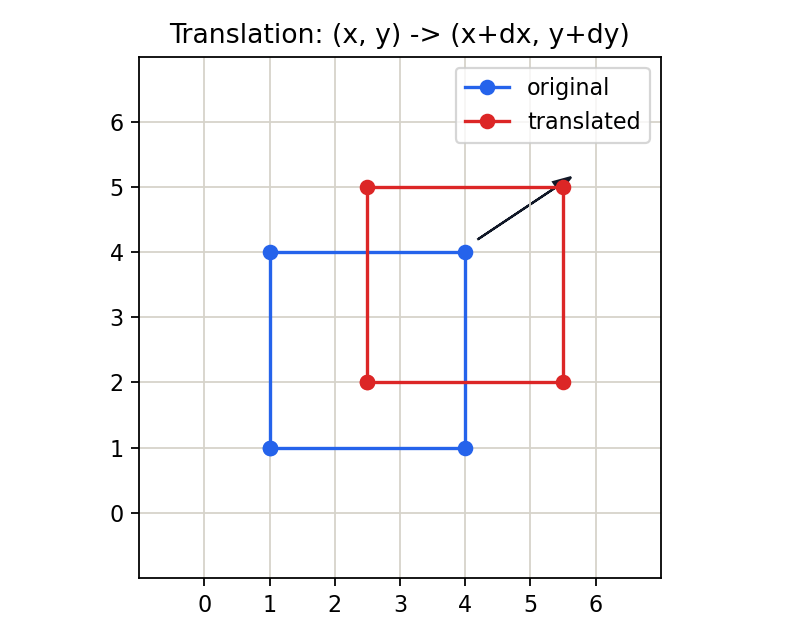

# 3.1.1_图像的平移

> [!note] 书中对应页
> PDF 页码：58
> 打开原页（Obsidian）：[[raw/books/数字图像处理基础_朱虹.pdf#page=58]]
>
> GitHub 公开仓库不随附原书 PDF；下载仓库后，将有权使用的同名 PDF 放入 `raw/books/`，下面的 Obsidian 本地内嵌预览才会显示。
> ![[raw/books/数字图像处理基础_朱虹.pdf#page=58]]


## 来源与状态

* 书名：数字图像处理基础
* 作者：朱虹
* 章节：第 3 章 图像几何变换
* 小节：3.1.1 图像的平移
* 书中页码：43
* PDF 页码：58
* 本地 PDF：raw/books/数字图像处理基础_朱虹.pdf
* 处理状态：已精修 / 需人工复核


## 核心概念

图像平移把每个像素坐标整体加上固定偏移量，形状、大小和方向保持不变。它是最简单的仿射变换，也是理解齐次坐标的入口。

## 关键公式

```math
x'=x+\Delta x,\quad y'=y+\Delta y,\quad \begin{bmatrix}x'\\y'\\1\end{bmatrix}=\begin{bmatrix}1&0&\Delta x\\0&1&\Delta y\\0&0&1\end{bmatrix}\begin{bmatrix}x\\y\\1\end{bmatrix}
```

公式按通用图像处理记号整理；若与原书符号、坐标原点或旋转方向约定不完全一致，需人工复核。

## 算法步骤

1. 输入原图、水平位移 dx、垂直位移 dy。
2. 构造平移矩阵。
3. 用反向映射遍历输出图像位置。
4. 越界坐标用常数、复制边界或透明背景填充。
5. 得到平移后的图像。

## 直观理解

平移就是把整张图片往右、左、上或下推一段距离；新露出的区域需要用某种边界值补上。

## 使用场景

目标对齐、图像拼接前粗配准、训练数据增强、校正扫描图像的偏移。

## 优点

参数少、计算快、几何意义清楚。

## 局限性

平移后边界会丢失部分内容，也会出现新空白区域。

## 和相关方法的对比

平移只改变位置，不改变方向；旋转会改变方向；缩放会改变尺寸。

## 教学图示



该图为本仓库原创教学示意图，不是原书截图。

## 对应代码

- [examples/03_geometric_transform/image_translation.py](../../examples/03_geometric_transform/image_translation.py)

## 相关知识

- [[3.1_图像的位置变换]]
- [[3.3_齐次坐标与图像的仿射变换]]
- [[3.4_图像几何畸变的校正]]

## 复习问题

1. dx、dy 的正负号如何影响移动方向？
2. 平移矩阵为什么需要齐次坐标才能写成矩阵乘法？
3. 边界填充值会怎样影响视觉结果？
