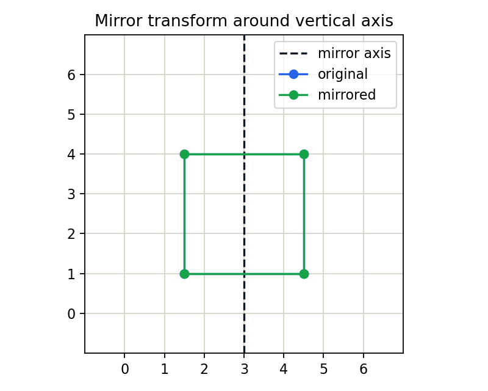

# 3.1.2_图像的镜像

> [!note] 书中对应页
> PDF 页码：59
> 打开原页（Obsidian）：[[raw/books/数字图像处理基础_朱虹.pdf#page=59]]
>
> GitHub 公开仓库不随附原书 PDF；下载仓库后，将有权使用的同名 PDF 放入 `raw/books/`，下面的 Obsidian 本地内嵌预览才会显示。
> ![[raw/books/数字图像处理基础_朱虹.pdf#page=59]]


## 来源与状态

* 书名：数字图像处理基础
* 作者：朱虹
* 章节：第 3 章 图像几何变换
* 小节：3.1.2 图像的镜像
* 书中页码：44
* PDF 页码：59
* 本地 PDF：raw/books/数字图像处理基础_朱虹.pdf
* 处理状态：已精修 / 需人工复核


## 核心概念

镜像变换把图像相对于某条轴翻转，水平镜像交换左右，垂直镜像交换上下。灰度值不变，但空间方位发生反向。

## 关键公式

```math
\text{水平镜像: }x'=W-1-x,\ y'=y;\quad \text{垂直镜像: }x'=x,\ y'=H-1-y
```

公式按通用图像处理记号整理；若与原书符号、坐标原点或旋转方向约定不完全一致，需人工复核。

## 算法步骤

1. 输入原图和镜像轴类型。
2. 根据宽度或高度计算对称坐标。
3. 将输出位置映射回输入位置。
4. 生成水平、垂直或双轴镜像图。

## 直观理解

镜像像把图像放到镜子前：像素到镜像轴的距离保持不变，但左右或上下顺序反过来。

## 使用场景

数据增强、相机坐标系转换、纠正左右颠倒的图像显示。

## 优点

无需插值，通常不会产生灰度模糊。

## 局限性

会改变目标朝向，某些有方向语义的任务不能随意镜像。

## 和相关方法的对比

镜像和旋转都改变方向；镜像会改变手性，旋转保持手性。

## 教学图示



该图为本仓库原创教学示意图，不是原书截图。

## 对应代码

- [examples/03_geometric_transform/image_mirror.py](../../examples/03_geometric_transform/image_mirror.py)

## 相关知识

- [[3.1_图像的位置变换]]
- [[3.1.3_图像的旋转]]
- [[3.3_齐次坐标与图像的仿射变换]]

## 复习问题

1. 水平镜像和垂直镜像的坐标公式有什么区别？
2. 为什么镜像一般不需要灰度插值？
3. 哪些识别任务不适合随意镜像？
