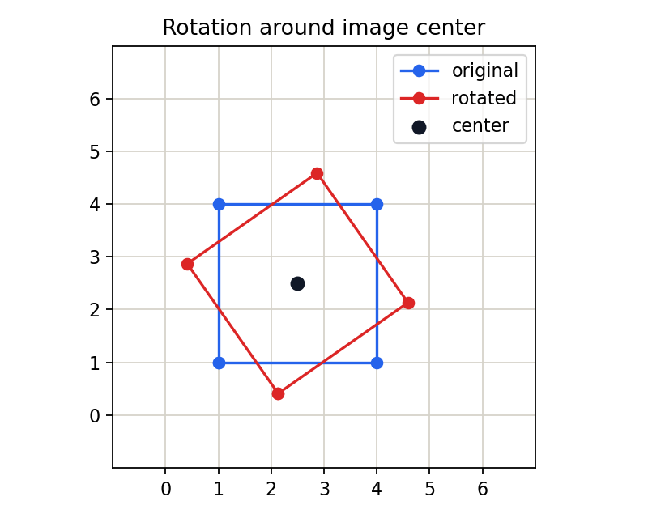

# 3.1.3_图像的旋转

> [!note] 书中对应页
> PDF 页码：60
> 打开原页（Obsidian）：[[raw/books/数字图像处理基础_朱虹.pdf#page=60]]
>
> GitHub 公开仓库不随附原书 PDF；下载仓库后，将有权使用的同名 PDF 放入 `raw/books/`，下面的 Obsidian 本地内嵌预览才会显示。
> ![[raw/books/数字图像处理基础_朱虹.pdf#page=60]]


## 来源与状态

* 书名：数字图像处理基础
* 作者：朱虹
* 章节：第 3 章 图像几何变换
* 小节：3.1.3 图像的旋转
* 书中页码：45
* PDF 页码：60
* 本地 PDF：raw/books/数字图像处理基础_朱虹.pdf
* 处理状态：已精修 / 需人工复核


## 核心概念

旋转变换让图像围绕指定中心按角度转动。除 90 度等特殊情况外，输出像素通常落在输入的非整数坐标上，因此插值质量很关键。

## 关键公式

```math
\begin{bmatrix}x'\\y'\end{bmatrix}=\begin{bmatrix}\cos\theta&-\sin\theta\\\sin\theta&\cos\theta\end{bmatrix}\begin{bmatrix}x-c_x\\y-c_y\end{bmatrix}+\begin{bmatrix}c_x\\c_y\end{bmatrix}
```

公式按通用图像处理记号整理；若与原书符号、坐标原点或旋转方向约定不完全一致，需人工复核。

## 算法步骤

1. 输入旋转角度、旋转中心和缩放因子。
2. 把坐标平移到旋转中心附近。
3. 应用旋转矩阵。
4. 把坐标平移回图像坐标系。
5. 对非整数坐标插值并处理边界。

## 直观理解

旋转不是简单交换行列，而是每个点围绕中心走圆弧；点转完后很少正好落在像素格中心。

## 使用场景

扫描件校正、目标姿态归一化、数据增强、遥感影像方向配准。

## 优点

能处理方向不一致问题，矩阵形式清晰。

## 局限性

可能裁剪边角，插值会带来轻微模糊。

## 和相关方法的对比

平移只改变原点位置；旋转依赖中心和角度；仿射变换可以同时包含旋转、平移、缩放和错切。

## 教学图示



该图为本仓库原创教学示意图，不是原书截图。

## 对应代码

- [examples/03_geometric_transform/image_rotation.py](../../examples/03_geometric_transform/image_rotation.py)

## 相关知识

- [[3.1_图像的位置变换]]
- [[3.3_齐次坐标与图像的仿射变换]]
- [[3.2.2_图像的放大]]

## 复习问题

1. 旋转中心改变会怎样影响结果？
2. 为什么旋转后边角容易被裁剪？
3. 最近邻和双线性插值在旋转图上有什么视觉差异？
