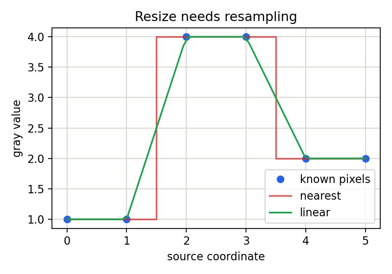

# 3.2.1_图像的缩小

> [!note] 书中对应页
> PDF 页码：65
> 打开原页（Obsidian）：[[raw/books/数字图像处理基础_朱虹.pdf#page=65]]
>
> GitHub 公开仓库不随附原书 PDF；下载仓库后，将有权使用的同名 PDF 放入 `raw/books/`，下面的 Obsidian 本地内嵌预览才会显示。
> ![[raw/books/数字图像处理基础_朱虹.pdf#page=65]]


## 来源与状态

* 书名：数字图像处理基础
* 作者：朱虹
* 章节：第 3 章 图像几何变换
* 小节：3.2.1 图像的缩小
* 书中页码：50
* PDF 页码：65
* 本地 PDF：raw/books/数字图像处理基础_朱虹.pdf
* 处理状态：已精修 / 需人工复核


## 核心概念

图像缩小把多个源像素的信息压到更少的输出像素中，本质是降采样。若直接抽点，容易丢失细节或产生混叠。

## 关键公式

```math
x=\frac{x'}{s_x},\quad y=\frac{y'}{s_y},\quad 0<s_x,s_y<1
```

公式按通用图像处理记号整理；若与原书符号、坐标原点或旋转方向约定不完全一致，需人工复核。

## 算法步骤

1. 输入缩放比例。
2. 计算输出尺寸。
3. 必要时先低通平滑以抑制混叠。
4. 按反向映射找到源图坐标。
5. 用区域插值或双线性插值得到输出。

## 直观理解

缩小像把更多格子压成更少格子，不能只随便挑一个代表，否则细线和纹理可能消失或变成假花纹。

## 使用场景

生成缩略图、构建图像金字塔、降低计算量、统一模型输入尺寸。

## 优点

节省存储和计算，便于多尺度处理。

## 局限性

不可避免丢失高频细节，处理不当会产生混叠。

## 和相关方法的对比

缩小推荐区域插值或预滤波；放大更关注新像素估计的平滑程度。

## 教学图示



该图为本仓库原创教学示意图，不是原书截图。

## 对应代码

- [examples/03_geometric_transform/image_resize.py](../../examples/03_geometric_transform/image_resize.py)

## 相关知识

- [[3.2_图像的形状变换]]
- [[3.2.2_图像的放大]]
- [[9.1_图像的频域变换（傅里叶变换）]]

## 复习问题

1. 为什么缩小前常需要低通滤波？
2. 区域插值为什么适合缩小？
3. 缩小会丢失哪些信息？
