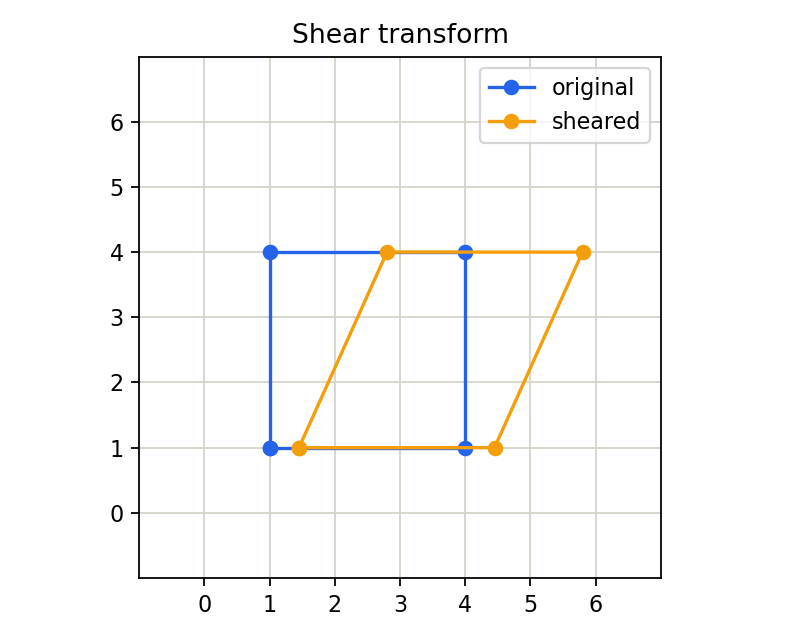

# 3.2.3_图像的错切

> [!note] 书中对应页
> PDF 页码：71
> 打开原页（Obsidian）：[[raw/books/数字图像处理基础_朱虹.pdf#page=71]]
>
> GitHub 公开仓库不随附原书 PDF；下载仓库后，将有权使用的同名 PDF 放入 `raw/books/`，下面的 Obsidian 本地内嵌预览才会显示。
> ![[raw/books/数字图像处理基础_朱虹.pdf#page=71]]


## 来源与状态

* 书名：数字图像处理基础
* 作者：朱虹
* 章节：第 3 章 图像几何变换
* 小节：3.2.3 图像的错切
* 书中页码：56
* PDF 页码：71
* 本地 PDF：raw/books/数字图像处理基础_朱虹.pdf
* 处理状态：已精修 / 需人工复核


## 核心概念

错切变换让图像沿某一方向按另一坐标成比例偏移，矩形会变成平行四边形，平行线仍保持平行。

## 关键公式

```math
x'=x+k_xy,\quad y'=y\quad \text{或}\quad x'=x,\ y'=y+k_yx
```

公式按通用图像处理记号整理；若与原书符号、坐标原点或旋转方向约定不完全一致，需人工复核。

## 算法步骤

1. 输入 x 或 y 方向错切系数。
2. 构造错切矩阵。
3. 估计输出画布范围。
4. 用反向映射和插值生成结果。
5. 处理新增空白区域。

## 直观理解

错切像推桌面上的一叠纸：底边不动，上边被横向推开。

## 使用场景

文档倾斜模拟、字符形变增强、仿射配准中的局部形变近似。

## 优点

参数少，可表示常见倾斜形变。

## 局限性

错切不能表达透视汇聚，过大时会带来明显空白和裁剪。

## 和相关方法的对比

错切是仿射变换的特殊形式；透视变换能让平行线汇聚，错切不能。

## 教学图示



该图为本仓库原创教学示意图，不是原书截图。

## 对应代码

- [examples/03_geometric_transform/image_shear.py](../../examples/03_geometric_transform/image_shear.py)

## 相关知识

- [[3.2_图像的形状变换]]
- [[3.3_齐次坐标与图像的仿射变换]]
- [[3.4_图像几何畸变的校正]]

## 复习问题

1. 错切后平行线是否仍平行？
2. 错切系数越大，输出画布会发生什么变化？
3. 错切和透视变换有什么边界？
