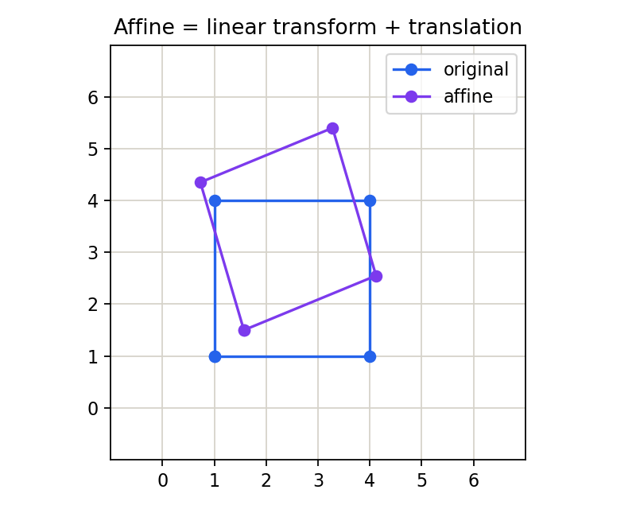

# 3.3_齐次坐标与图像的仿射变换

> [!note] 书中对应页
> PDF 页码：73
> 打开原页（Obsidian）：[[raw/books/数字图像处理基础_朱虹.pdf#page=73]]
>
> GitHub 公开仓库不随附原书 PDF；下载仓库后，将有权使用的同名 PDF 放入 `raw/books/`，下面的 Obsidian 本地内嵌预览才会显示。
> ![[raw/books/数字图像处理基础_朱虹.pdf#page=73]]


## 来源与状态

* 书名：数字图像处理基础
* 作者：朱虹
* 章节：第 3 章 图像几何变换
* 小节：3.3 齐次坐标与图像的仿射变换
* 书中页码：58
* PDF 页码：73
* 本地 PDF：raw/books/数字图像处理基础_朱虹.pdf
* 处理状态：已精修 / 需人工复核


## 核心概念

齐次坐标把平移也写进矩阵乘法，使平移、旋转、缩放和错切能统一为一个 3×3 矩阵。仿射变换保持直线和平行关系，是第 3 章的组织核心。

## 关键公式

```math
\begin{bmatrix}x'\\y'\\1\end{bmatrix}=\begin{bmatrix}a&b&t_x\\c&d&t_y\\0&0&1\end{bmatrix}\begin{bmatrix}x\\y\\1\end{bmatrix}
```

公式按通用图像处理记号整理；若与原书符号、坐标原点或旋转方向约定不完全一致，需人工复核。

## 算法步骤

1. 把二维坐标扩展为齐次坐标。
2. 按任务构造仿射矩阵。
3. 组合多个矩阵时注意乘法顺序。
4. 用反向映射得到源图坐标。
5. 插值并输出仿射变换图。

## 直观理解

齐次坐标像给二维点多加一个工具位，让“加偏移”和“乘矩阵”放进同一种写法。

## 使用场景

图像配准、目标姿态归一化、数据增强、文档校正的仿射近似。

## 优点

表达统一，便于组合和求逆；平移、旋转、缩放、错切都可纳入同一框架。

## 局限性

不能表达所有透视畸变或复杂非线性畸变。

## 和相关方法的对比

平移、旋转、缩放、错切都是仿射的特殊形式；几何畸变校正常常需要更一般的非线性映射。

## 教学图示



该图为本仓库原创教学示意图，不是原书截图。

## 对应代码

- [examples/03_geometric_transform/affine_transform.py](../../examples/03_geometric_transform/affine_transform.py)

## 相关知识

- [[3.1.1_图像的平移]]
- [[3.1.3_图像的旋转]]
- [[3.2.3_图像的错切]]
- [[3.4_图像几何畸变的校正]]

## 复习问题

1. 为什么普通 2×2 矩阵不能直接表示平移？
2. 仿射变换保持哪些几何性质？
3. 多个变换矩阵组合时为什么顺序重要？
4. 仿射和透视变换的差别是什么？
