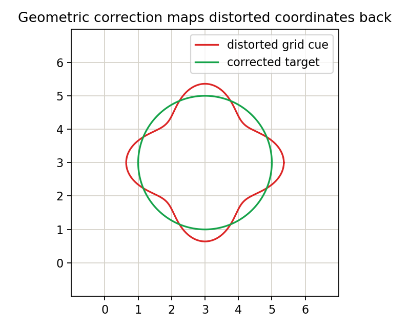

# 3.4_图像几何畸变的校正

> [!note] 书中对应页
> PDF 页码：74
> 打开原页（Obsidian）：[[raw/books/数字图像处理基础_朱虹.pdf#page=74]]
>
> GitHub 公开仓库不随附原书 PDF；下载仓库后，将有权使用的同名 PDF 放入 `raw/books/`，下面的 Obsidian 本地内嵌预览才会显示。
> ![[raw/books/数字图像处理基础_朱虹.pdf#page=74]]


## 来源与状态

* 书名：数字图像处理基础
* 作者：朱虹
* 章节：第 3 章 图像几何变换
* 小节：3.4 图像几何畸变的校正
* 书中页码：59
* PDF 页码：74
* 本地 PDF：raw/books/数字图像处理基础_朱虹.pdf
* 处理状态：已精修 / 需人工复核


## 核心概念

几何畸变校正根据畸变模型或控制点，把弯曲、倾斜或非线性偏移的图像坐标映射回理想坐标。它依赖坐标映射、插值和边界处理。

## 关键公式

```math
(x_s,y_s)=F^{-1}(x_d,y_d),\quad g(x_d,y_d)=f(x_s,y_s)
```

公式按通用图像处理记号整理；若与原书符号、坐标原点或旋转方向约定不完全一致，需人工复核。

## 算法步骤

1. 识别畸变类型或采集控制点。
2. 估计从校正图到原图的反向映射。
3. 遍历输出图像坐标并查找源图位置。
4. 对源图浮点坐标插值。
5. 评估直线、网格或标定点是否恢复合理。

## 直观理解

校正不是简单把图像拉直，而是为输出图每个位置找到它在畸变原图中对应的来源。

## 使用场景

镜头畸变校正、扫描件校正、遥感几何校正、工业相机标定后的图像标准化。

## 优点

能补偿成像系统或拍摄姿态导致的几何误差。

## 局限性

依赖模型或控制点质量；错误映射会造成局部拉伸、压缩和插值伪影。

## 和相关方法的对比

仿射变换处理全局线性几何关系；畸变校正可以是非线性坐标映射。

## 教学图示



该图为本仓库原创教学示意图，不是原书截图。

## 对应代码

- [examples/03_geometric_transform/geometric_correction.py](../../examples/03_geometric_transform/geometric_correction.py)

## 相关知识

- [[3.3_齐次坐标与图像的仿射变换]]
- [[3.1_图像的位置变换]]
- [[3.2_图像的形状变换]]

## 复习问题

1. 为什么几何畸变校正常用反向映射？
2. 控制点误差会怎样影响校正结果？
3. 仿射校正和径向畸变校正适用场景有何不同？
