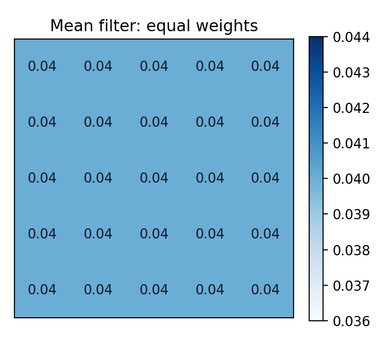

# 4.2_均值滤波

> [!note] 书中对应页
> PDF 页码：80
> 打开原页（Obsidian）：[[raw/books/数字图像处理基础_朱虹.pdf#page=80]]
>
> GitHub 公开仓库不随附原书 PDF；下载仓库后，将有权使用的同名 PDF 放入 `raw/books/`，下面的 Obsidian 本地内嵌预览才会显示。
> ![[raw/books/数字图像处理基础_朱虹.pdf#page=80]]


## 来源与状态

* 书名：数字图像处理基础
* 作者：朱虹
* 章节：第 4 章 图像去噪
* 小节：4.2 均值滤波
* 书中页码：65
* PDF 页码：80
* 本地 PDF：raw/books/数字图像处理基础_朱虹.pdf
* 处理状态：已精修 / 需人工复核


## 核心概念

均值滤波用邻域像素平均值替换中心像素，适合抑制零均值加性噪声。它本质是低通平滑，会同时削弱噪声和高频细节。

## 关键公式

```math
g(x,y)=\frac{1}{mn}\sum_{(i,j)\in\Omega}f(x+i,y+j)
```

公式按通用图像处理记号整理；与原书符号、窗口定义或边界约定不一致处，需人工复核。

## 算法步骤

1. 输入灰度图和窗口大小。
2. 为每个像素取 m×n 邻域。
3. 计算邻域平均值。
4. 用平均值替换中心像素。
5. 检查噪声降低和边缘模糊的折中。

## 直观理解

均值滤波像让一个像素听取周围邻居的平均意见，随机噪声会被抵消，但真实边缘也会被拉平。

## 使用场景

轻微高斯噪声、预平滑、边缘检测前的粗降噪。

## 优点

简单、快速、易实现。

## 局限性

容易模糊边缘和细节，对椒盐噪声不鲁棒。

## 和相关方法的对比

相较中值滤波，均值滤波对脉冲异常值敏感；相较边界保持滤波，它不会区分边缘两侧像素。

## 教学图示



该图为本仓库原创教学示意图，不是原书截图。

## 对应代码

- [examples/04_image_denoising/mean_filter.py](../../examples/04_image_denoising/mean_filter.py)

## 相关知识

- [[4.2.1_均值滤波的原理]]
- [[4.2.2_均值滤波方法]]
- [[4.3_中值滤波]]
- [[5.1_图像细节的基本特征]]

## 复习问题

1. 均值滤波为什么能降低零均值噪声？
2. 窗口越大会带来什么副作用？
3. 均值滤波为什么容易模糊边缘？
