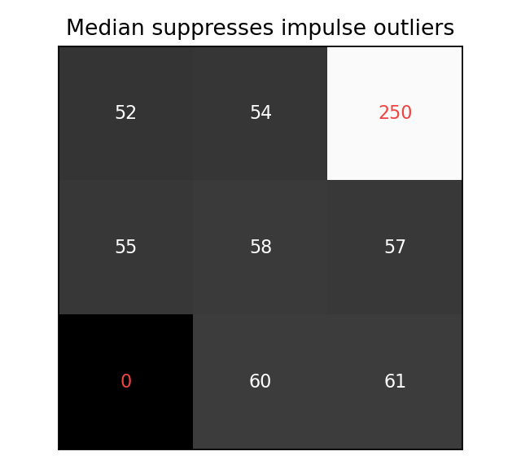

# 4.3_中值滤波

> [!note] 书中对应页
> PDF 页码：84
> 打开原页（Obsidian）：[[raw/books/数字图像处理基础_朱虹.pdf#page=84]]
>
> GitHub 公开仓库不随附原书 PDF；下载仓库后，将有权使用的同名 PDF 放入 `raw/books/`，下面的 Obsidian 本地内嵌预览才会显示。
> ![[raw/books/数字图像处理基础_朱虹.pdf#page=84]]


## 来源与状态

* 书名：数字图像处理基础
* 作者：朱虹
* 章节：第 4 章 图像去噪
* 小节：4.3 中值滤波
* 书中页码：69
* PDF 页码：84
* 本地 PDF：raw/books/数字图像处理基础_朱虹.pdf
* 处理状态：已精修 / 需人工复核


## 核心概念

中值滤波用邻域排序后的中间值替换中心像素，对孤立极大或极小的脉冲噪声很有效。它是非线性滤波，常用于椒盐噪声。

## 关键公式

```math
g(x,y)=median\{f(x+i,y+j)\mid(i,j)\in\Omega\}
```

公式按通用图像处理记号整理；与原书符号、窗口定义或边界约定不一致处，需人工复核。

## 算法步骤

1. 输入图像和奇数窗口大小。
2. 取中心像素周围邻域。
3. 对邻域灰度排序。
4. 取中间值作为输出。
5. 比较椒盐点是否被去除以及边缘是否保持。

## 直观理解

中值滤波像投票选中间意见，极端黑点或白点会被多数正常像素压下去。

## 使用场景

椒盐噪声、二值或灰度图孤立异常点清理、分割前预处理。

## 优点

对孤立脉冲噪声鲁棒，边缘保持通常好于均值滤波。

## 局限性

对高斯噪声未必最优；窗口过大会破坏细小结构。

## 和相关方法的对比

均值会被极端值拉偏，中值对极端值不敏感。

## 教学图示



该图为本仓库原创教学示意图，不是原书截图。

## 对应代码

- [examples/04_image_denoising/median_filter.py](../../examples/04_image_denoising/median_filter.py)

## 相关知识

- [[4.3.1_中值滤波的原理]]
- [[4.3.2_中值滤波方法]]
- [[7.2_腐蚀与膨胀]]

## 复习问题

1. 为什么中值滤波适合椒盐噪声？
2. 为什么窗口通常取奇数尺寸？
3. 中值滤波会怎样影响细线结构？
