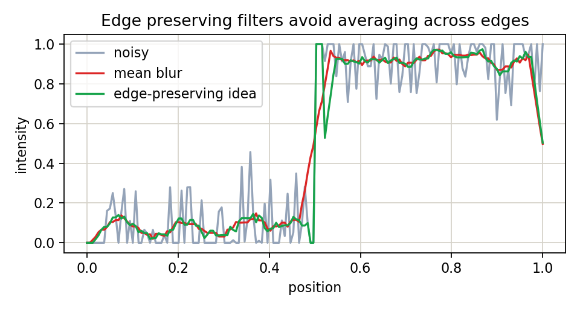

# 4.4.1_K近邻均值滤波

> [!note] 书中对应页
> PDF 页码：87
> 打开原页（Obsidian）：[[raw/books/数字图像处理基础_朱虹.pdf#page=87]]
>
> GitHub 公开仓库不随附原书 PDF；下载仓库后，将有权使用的同名 PDF 放入 `raw/books/`，下面的 Obsidian 本地内嵌预览才会显示。
> ![[raw/books/数字图像处理基础_朱虹.pdf#page=87]]


## 来源与状态

* 书名：数字图像处理基础
* 作者：朱虹
* 章节：第 4 章 图像去噪
* 小节：4.4.1 K近邻均值滤波
* 书中页码：72
* PDF 页码：87
* 本地 PDF：raw/books/数字图像处理基础_朱虹.pdf
* 处理状态：已精修 / 需人工复核


## 核心概念

K近邻均值滤波在窗口中选择与中心像素灰度最接近的 K 个像素求平均，避免明显不同区域的像素参与平滑。

## 关键公式

```math
S_K=\operatorname{arg\,topK}_{p\in\Omega}(-|f(p)-f_c|),\quad g=\frac{1}{K}\sum_{p\in S_K}f(p)
```

公式按通用图像处理记号整理；与原书符号、窗口定义或边界约定不一致处，需人工复核。

## 算法步骤

1. 输入窗口大小和 K。
2. 计算窗口内每个像素与中心灰度差。
3. 选取差值最小的 K 个像素。
4. 对这些像素求均值。
5. 输出边界保持平滑结果。

## 直观理解

它不是平均所有邻居，而是挑最像中心像素的邻居来平均。

## 使用场景

边缘附近去噪、纹理较弱但边界清楚的图像。

## 优点

比普通均值滤波更少跨边缘模糊。

## 局限性

K 过小去噪弱，K 过大又退化为普通均值。

## 和相关方法的对比

对称近邻按成对位置选择，K近邻按灰度相似性排序选择。

## 教学图示



该图为本仓库原创教学示意图，不是原书截图。

## 对应代码

- [examples/04_image_denoising/k_nearest_mean_filter.py](../../examples/04_image_denoising/k_nearest_mean_filter.py)

## 相关知识

- [[4.4_边界保持类平滑滤波]]
- [[4.4.2_对称近邻均值滤波]]

## 复习问题

1. K 值太大或太小分别有什么问题？
2. 为什么灰度相似性能帮助保边？
3. K近邻均值与双边滤波思想有什么相似处？
