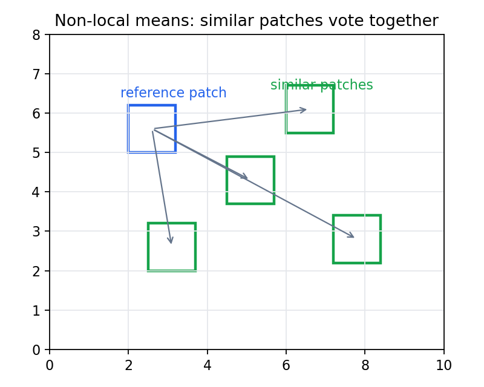

# 4.5_非局部均值滤波

> [!note] 书中对应页
> PDF 页码：90
> 打开原页（Obsidian）：[[raw/books/数字图像处理基础_朱虹.pdf#page=90]]
>
> GitHub 公开仓库不随附原书 PDF；下载仓库后，将有权使用的同名 PDF 放入 `raw/books/`，下面的 Obsidian 本地内嵌预览才会显示。
> ![[raw/books/数字图像处理基础_朱虹.pdf#page=90]]


## 来源与状态

* 书名：数字图像处理基础
* 作者：朱虹
* 章节：第 4 章 图像去噪
* 小节：4.5 非局部均值滤波
* 书中页码：75
* PDF 页码：90
* 本地 PDF：raw/books/数字图像处理基础_朱虹.pdf
* 处理状态：已精修 / 需人工复核


## 核心概念

非局部均值滤波不只看空间邻近像素，而是在搜索窗口中寻找与参考块相似的图像块，用相似块的加权平均恢复中心像素。

## 关键公式

```math
g(i)=\sum_j w(i,j)f(j),\quad w(i,j)\propto \exp\left(-\frac{\|P_i-P_j\|^2}{h^2}\right)
```

公式按通用图像处理记号整理；与原书符号、窗口定义或边界约定不一致处，需人工复核。

## 算法步骤

1. 输入参考块大小、搜索窗口和滤波强度 h。
2. 为每个像素提取参考块。
3. 在搜索窗口中计算其他块与参考块的相似度。
4. 根据相似度生成权重。
5. 用加权平均输出去噪像素。

## 直观理解

如果图像里有很多相似纹理块，就让这些相似块互相投票，而不是只相信附近几个像素。

## 使用场景

纹理重复图像、自然图像高质量去噪、低照度图像预处理。

## 优点

能利用非局部重复结构，细节保持较好。

## 局限性

计算量较大，参数 h 和窗口大小敏感。

## 和相关方法的对比

局部滤波只看附近像素；非局部均值看相似块，空间上可以更远。

## 教学图示



该图为本仓库原创教学示意图，不是原书截图。

## 对应代码

- [examples/04_image_denoising/non_local_means_filter.py](../../examples/04_image_denoising/non_local_means_filter.py)

## 相关知识

- [[4.1_图像噪声]]
- [[4.4_边界保持类平滑滤波]]
- [[9.3.4_应用于图像去噪]]

## 复习问题

1. 非局部均值中的“非局部”是什么意思？
2. h 参数过大会怎样？
3. 为什么相似块比单个相似像素更可靠？
