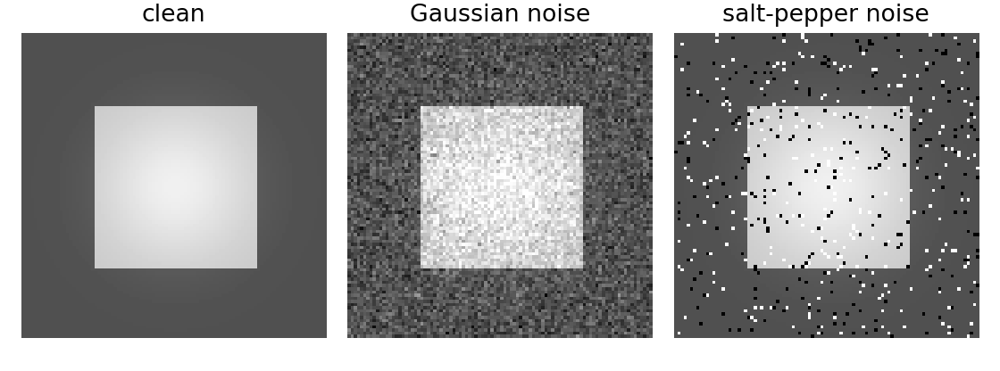

# 4.x_习题

> [!note] 书中对应页
> PDF 页码：92
> 打开原页（Obsidian）：[[raw/books/数字图像处理基础_朱虹.pdf#page=92]]
>
> GitHub 公开仓库不随附原书 PDF；下载仓库后，将有权使用的同名 PDF 放入 `raw/books/`，下面的 Obsidian 本地内嵌预览才会显示。
> ![[raw/books/数字图像处理基础_朱虹.pdf#page=92]]


## 来源与状态

* 书名：数字图像处理基础
* 作者：朱虹
* 章节：第 4 章 图像去噪
* 小节：4.x 习题
* 书中页码：77
* PDF 页码：92
* 本地 PDF：raw/books/数字图像处理基础_朱虹.pdf
* 处理状态：已精修 / 需人工复核


## 核心概念

第 4 章习题应围绕噪声类型、滤波器选择、参数影响和边缘保持能力展开。复习时要能说明为什么某种噪声适合某种滤波器。

## 关键公式

```math
\text{去噪选择}=f(\text{噪声类型},\text{边缘保持要求},\text{计算量})
```

公式按通用图像处理记号整理；与原书符号、窗口定义或边界约定不一致处，需人工复核。

## 算法步骤

1. 判断噪声类型。
2. 选择候选滤波器。
3. 写出核心公式。
4. 分析参数变化。
5. 用示例脚本验证。

## 直观理解

做去噪题的关键不是背滤波名字，而是解释噪声、边缘和滤波窗口之间的取舍。

## 使用场景

课程复习、实验报告、算法选型。

## 优点

把方法和噪声模型对应起来。

## 局限性

原书习题细节需人工复核。

## 和相关方法的对比

第 4 章重噪声抑制，第 5 章重细节增强；两章经常前后衔接。

## 教学图示



该图为本仓库原创教学示意图，不是原书截图。

## 对应代码

- [examples/04_image_denoising/README.md](../../examples/04_image_denoising/README.md)

## 相关知识

- [[4.1_图像噪声]]
- [[4.2_均值滤波]]
- [[4.3_中值滤波]]
- [[4.5_非局部均值滤波]]

## 复习问题

1. 如何根据噪声类型选择滤波器？
2. 去噪和锐化为什么常有矛盾？
3. 如何证明一个滤波器保边能力更强？
