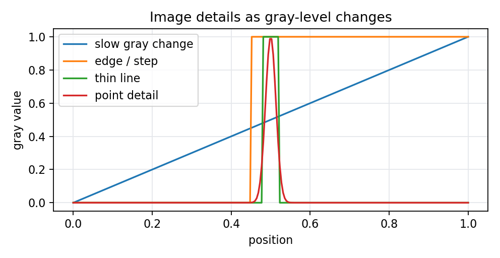

# 5.1 图像细节的基本特征

> [!note] 书中对应页
> PDF 页码：96
> 打开原页（Obsidian）：[[raw/books/数字图像处理基础_朱虹.pdf#page=96]]
>
> GitHub 公开仓库不随附原书 PDF；下载仓库后，将有权使用的同名 PDF 放入 `raw/books/`，下面的 Obsidian 本地内嵌预览才会显示。
> ![[raw/books/数字图像处理基础_朱虹.pdf#page=96]]

## 来源与状态

- 书名：数字图像处理基础
- 作者：朱虹
- 章节：第 5 章 图像锐化
- 小节：5.1 图像细节的基本特征
- 书中页码：需人工复核
- PDF 页码：需人工复核
- 本地 PDF：raw/books/数字图像处理基础_朱虹.pdf
- 处理状态：已精修 / 需人工复核

## 核心概念

图像锐化关注的是灰度在空间位置上的快速变化。点、细线、边缘和纹理都可以看成局部灰度突变；平坦区域或缓慢变化区域则不应被过度放大。理解这一点后，锐化就不只是让图像看起来更清楚，而是有选择地增强高频细节。

## 关键公式

- 一阶差分可近似局部变化率：\(g_x=f(x+1,y)-f(x,y)\)，\(g_y=f(x,y+1)-f(x,y)\)。
- 梯度幅值常写成：\(|\nabla f|=\sqrt{g_x^2+g_y^2}\)，实际实现也常用 \(|g_x|+|g_y|\) 近似。

## 算法步骤

1. 输入灰度图像。
2. 观察局部窗口内像素是否有快速变化。
3. 用一阶或二阶差分估计变化强度。
4. 将变化强的位置作为边缘、细线或纹理候选输出。

## 直观理解

平滑区域像缓坡，锐化方法不该大幅响应；边缘像台阶，差分后会出现峰值；孤立点和细线比边缘更局部，二阶算子通常更敏感。

## 使用场景

显微图像细胞边界、文档扫描文字边缘、工业零件轮廓、医学图像结构轮廓增强。

## 优点

- 把锐化目标从主观清晰转化为局部变化检测。
- 为一阶、二阶、Canny、LoG 等方法建立共同语言。

## 局限性

- 噪声也是快速变化，未经平滑直接锐化会放大噪声。
- 强纹理和真实边缘都属于高频，单靠差分不一定能区分。

## 和相关方法的对比

- 图像锐化 vs [[04_图像去噪/4.2_均值滤波|图像去噪]]：前者放大变化，后者抑制变化。
- 一阶变化强调边缘方向，二阶变化强调灰度曲率和细节转折。

## 教学图示

## 对应代码

本节偏概念复习，无单独代码；可结合本章其他示例运行。

## 相关知识

- [[05_图像锐化/5.2_一阶微分算子|一阶微分算子]]
- [[05_图像锐化/5.3_二阶微分算子|二阶微分算子]]
- [[04_图像去噪/4.1_图像噪声|图像噪声]]

## 复习问题

1. 为什么噪声会被锐化算子放大？
2. 点、线、边缘在灰度剖面上有什么差异？
3. 为什么锐化前常常需要先平滑？
