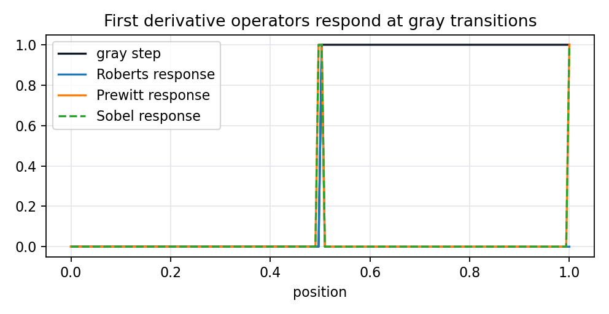

# 5.2.3 Sobel微分算子

> [!note] 书中对应页
> PDF 页码：96
> 打开原页（Obsidian）：[[raw/books/数字图像处理基础_朱虹.pdf#page=96]]
>
> GitHub 公开仓库不随附原书 PDF；下载仓库后，将有权使用的同名 PDF 放入 `raw/books/`，下面的 Obsidian 本地内嵌预览才会显示。
> ![[raw/books/数字图像处理基础_朱虹.pdf#page=96]]

## 来源与状态

- 书名：数字图像处理基础
- 作者：朱虹
- 章节：第 5 章 图像锐化
- 小节：5.2.3 Sobel微分算子
- 书中页码：需人工复核
- PDF 页码：需人工复核
- 本地 PDF：raw/books/数字图像处理基础_朱虹.pdf
- 处理状态：已精修 / 需人工复核

## 核心概念

Sobel 算子在差分的同时引入垂直于差分方向的加权平滑。中间行或中间列权重为 2，使它比简单差分更稳定，是经典边缘检测和梯度计算的常用算子。

## 关键公式

- \(K_x=\begin{bmatrix}-1&0&1\\-2&0&2\\-1&0&1\end{bmatrix}\)，\(K_y=K_x^T\)。
- 边缘强度：\(M=\sqrt{(f*K_x)^2+(f*K_y)^2}\)。

## 算法步骤

1. 输入灰度图。
2. 用 Sobel x/y 模板计算两个方向梯度。
3. 计算幅值，可选计算方向。
4. 根据应用做归一化、阈值化或作为 Canny 的前置梯度。

## 直观理解

Sobel 不是只看左右两个像素，而是把邻域里多行/多列一起看，中间线权重更高，所以对孤立噪声没那么冲动。

## 使用场景

通用边缘检测、纹理梯度、目标轮廓增强、Canny 前的梯度估计。

## 优点

- 方向明确，抗噪性比 Roberts 更好。
- OpenCV 等库支持完善。
- 可直接输出 x/y 梯度。

## 局限性

- 仍然是局部线性算子，对强噪声需要预平滑。
- 边缘可能较粗，需要后续细化。

## 和相关方法的对比

- Sobel vs Prewitt：Sobel 中心权重更大，平滑和差分结合更强。
- Sobel vs Canny：Sobel 给梯度图，Canny 在此基础上做细化和连接。

## 教学图示

## 对应代码

[sobel_operator.py](../../examples/05_image_sharpening/sobel_operator.py)

## 相关知识

- [[05_图像锐化/5.5_Canny算子|Canny算子]]
- [[05_图像锐化/5.2.4_Priwitt微分算子|Priwitt微分算子]]

## 复习问题

1. Sobel 模板中权重 2 的作用是什么？
2. Sobel 输出的边缘为什么可能较粗？
3. Sobel 和 Canny 的关系是什么？
