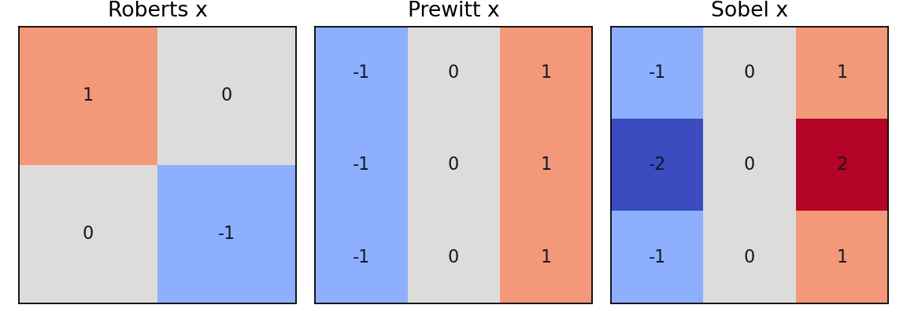

# 5.2 一阶微分算子

> [!note] 书中对应页
> PDF 页码：96
> 打开原页（Obsidian）：[[raw/books/数字图像处理基础_朱虹.pdf#page=96]]
>
> GitHub 公开仓库不随附原书 PDF；下载仓库后，将有权使用的同名 PDF 放入 `raw/books/`，下面的 Obsidian 本地内嵌预览才会显示。
> ![[raw/books/数字图像处理基础_朱虹.pdf#page=96]]

## 来源与状态

- 书名：数字图像处理基础
- 作者：朱虹
- 章节：第 5 章 图像锐化
- 小节：5.2 一阶微分算子
- 书中页码：需人工复核
- PDF 页码：需人工复核
- 本地 PDF：raw/books/数字图像处理基础_朱虹.pdf
- 处理状态：已精修 / 需人工复核

## 核心概念

一阶微分算子用相邻像素差分近似梯度，主要检测灰度阶跃和边缘方向。它把水平、垂直或对角方向的灰度变化变成响应强度，响应越大表示该方向的边缘越明显。

## 关键公式

- 梯度向量：\(\nabla f=[\partial f/\partial x,\partial f/\partial y]^T\)。
- 幅值：\(M=\sqrt{G_x^2+G_y^2}\)，方向：\(\theta=\arctan(G_y/G_x)\)。

## 算法步骤

1. 输入灰度图。
2. 选择一阶差分模板，如 Roberts、Prewitt 或 Sobel。
3. 分别卷积得到 \(G_x\) 和 \(G_y\)。
4. 计算梯度幅值和方向。
5. 按阈值或后续流程得到边缘图。

## 直观理解

把模板放到图像上滑动，一边看左边和右边差多少，一边看上边和下边差多少；差得越大，就越像边缘。

## 使用场景

边缘检测、轮廓提取、锐化预处理、目标分割前的边界提示。

## 优点

- 实现简单，计算量低。
- 可以给出边缘方向。
- 与阈值、非极大值抑制等步骤容易组合。

## 局限性

- 对噪声敏感。
- 只用局部窗口，容易产生断裂边缘。
- 阈值选择会明显影响结果。

## 和相关方法的对比

- Roberts 窗口小、定位敏感；Prewitt 平滑较弱；Sobel 对中心行列加权，抗噪略好。
- 一阶微分 vs 二阶微分：一阶响应边缘峰值，二阶常在边缘两侧出现符号变化。

## 教学图示

## 对应代码

[sobel_operator.py](../../examples/05_image_sharpening/sobel_operator.py)

## 相关知识

- [[05_图像锐化/5.2.2_Roberts交叉微分算子|Roberts交叉微分算子]]
- [[05_图像锐化/5.2.3_Sobel微分算子|Sobel微分算子]]
- [[05_图像锐化/5.5_Canny算子|Canny算子]]

## 复习问题

1. 为什么一阶微分能检测阶跃边缘？
2. 梯度方向和边缘方向是什么关系？
3. 为什么 Sobel 通常比简单差分更稳？
