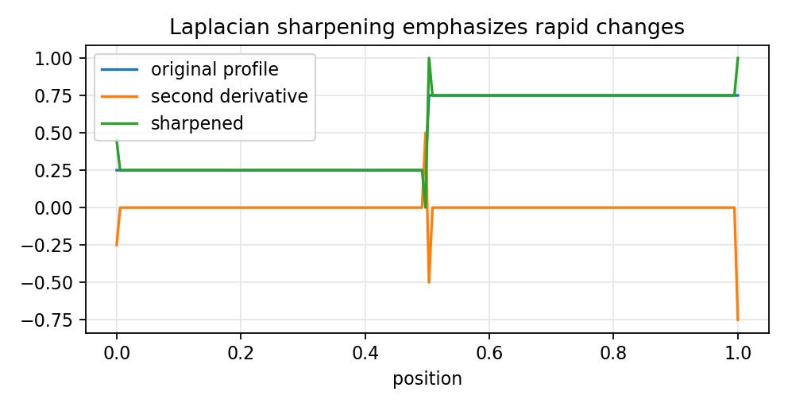

# 5.3.1 Laplacian微分算子

> [!note] 书中对应页
> PDF 页码：96
> 打开原页（Obsidian）：[[raw/books/数字图像处理基础_朱虹.pdf#page=96]]
>
> GitHub 公开仓库不随附原书 PDF；下载仓库后，将有权使用的同名 PDF 放入 `raw/books/`，下面的 Obsidian 本地内嵌预览才会显示。
> ![[raw/books/数字图像处理基础_朱虹.pdf#page=96]]

## 来源与状态

- 书名：数字图像处理基础
- 作者：朱虹
- 章节：第 5 章 图像锐化
- 小节：5.3.1 Laplacian微分算子
- 书中页码：需人工复核
- PDF 页码：需人工复核
- 本地 PDF：raw/books/数字图像处理基础_朱虹.pdf
- 处理状态：已精修 / 需人工复核

## 核心概念

Laplacian 是最常见的二阶微分算子，把 x 和 y 两个方向的二阶差分相加。它不直接给边缘方向，重点是突出灰度变化的转折位置。

## 关键公式

- \(\nabla^2 f=f(x+1,y)+f(x-1,y)+f(x,y+1)+f(x,y-1)-4f(x,y)\)。
- 锐化形式常写为：\(g=f-c\nabla^2 f\) 或 \(g=f+c\nabla^2 f\)，取决于模板符号，需人工复核。

## 算法步骤

1. 输入灰度图。
2. 计算 Laplacian 响应。
3. 按模板符号将响应与原图组合。
4. 归一化或裁剪输出锐化图。

## 直观理解

如果一个像素和四周差异很大，Laplacian 响应就大；把这个响应反馈到原图，就能让局部细节更突出。

## 使用场景

文字增强、纹理强化、边缘预突出、教学中观察二阶差分效果。

## 优点

- 模板简单，方向无关。
- 对点、线和细边缘响应强。

## 局限性

- 对噪声和压缩块效应敏感。
- 不提供边缘方向。
- 锐化强度过大会产生过冲。

## 和相关方法的对比

- Laplacian vs Sobel：Laplacian 是二阶无方向响应，Sobel 是一阶方向响应。
- Laplacian vs LoG：LoG 在 Laplacian 前加入高斯平滑。

## 教学图示

## 对应代码

[laplacian_operator.py](../../examples/05_image_sharpening/laplacian_operator.py)

## 相关知识

- [[05_图像锐化/5.2.3_Sobel微分算子|Sobel微分算子]]
- [[05_图像锐化/5.6_LOG滤波算法|LOG滤波算法]]

## 复习问题

1. Laplacian 为什么没有显式方向？
2. 锐化时响应应加还是减由什么决定？
3. 如何缓解 Laplacian 放大噪声的问题？
