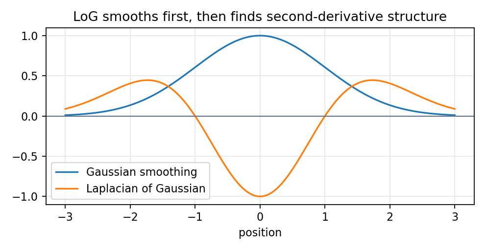

# 5.6 LOG滤波算法

> [!note] 书中对应页
> PDF 页码：96
> 打开原页（Obsidian）：[[raw/books/数字图像处理基础_朱虹.pdf#page=96]]
>
> GitHub 公开仓库不随附原书 PDF；下载仓库后，将有权使用的同名 PDF 放入 `raw/books/`，下面的 Obsidian 本地内嵌预览才会显示。
> ![[raw/books/数字图像处理基础_朱虹.pdf#page=96]]

## 来源与状态

- 书名：数字图像处理基础
- 作者：朱虹
- 章节：第 5 章 图像锐化
- 小节：5.6 LOG滤波算法
- 书中页码：需人工复核
- PDF 页码：需人工复核
- 本地 PDF：raw/books/数字图像处理基础_朱虹.pdf
- 处理状态：已精修 / 需人工复核

## 核心概念

LOG 即 Laplacian of Gaussian，先用高斯滤波抑制噪声，再用 Laplacian 检测二阶变化。它把平滑和二阶边缘响应合成一个思想，常用于零交叉边缘检测。

## 关键公式

- \(LoG(x,y)=\nabla^2 G_\sigma(x,y)\)。
- 等价计算思路：\(R=\nabla^2(G_\sigma * I)\)。
- 零交叉处可作为边缘候选，阈值规则需人工复核。

## 算法步骤

1. 输入灰度图。
2. 选择高斯尺度 \(\sigma\)。
3. 先平滑，再计算 Laplacian，或直接用 LoG 模板卷积。
4. 寻找响应符号变化且幅值足够的位置。
5. 输出边缘或细节响应图。

## 直观理解

Laplacian 很怕噪声，所以 LoG 先把小噪声压下去，再寻找真正的灰度转折。

## 使用场景

噪声存在时的二阶边缘检测、尺度空间边缘分析、Blob 或轮廓预检测教学实验。

## 优点

- 比裸 Laplacian 更抗噪。
- 尺度参数能控制检测粗细。

## 局限性

- 尺度过小仍受噪声影响，尺度过大可能抹掉细节。
- 零交叉判定实现比简单阈值复杂。

## 和相关方法的对比

- LoG vs Laplacian：LoG 先平滑再二阶微分。
- LoG vs Canny：LoG 用二阶零交叉思想，Canny 用一阶梯度、非极大值抑制和双阈值连接。

## 教学图示

## 对应代码

[log_filter.py](../../examples/05_image_sharpening/log_filter.py)

## 相关知识

- [[05_图像锐化/5.3.1_Laplacian微分算子|Laplacian微分算子]]
- [[05_图像锐化/5.5_Canny算子|Canny算子]]
- [[04_图像去噪/4.2_均值滤波|均值滤波]]

## 复习问题

1. LoG 为什么要先做高斯平滑？
2. 尺度 \(\sigma\) 变大后边缘结果会怎样？
3. LoG 和 Canny 的核心差异是什么？
