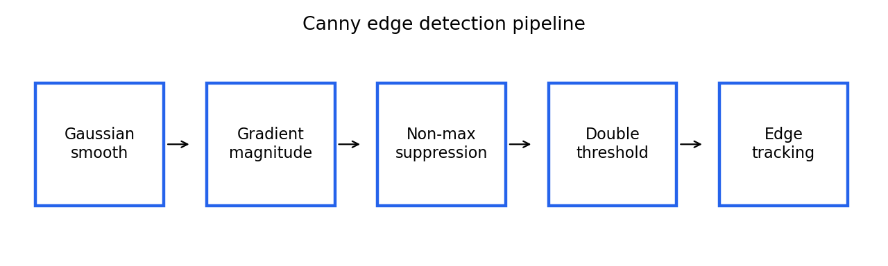

# 5.x 习题

> [!note] 书中对应页
> PDF 页码：96
> 打开原页（Obsidian）：[[raw/books/数字图像处理基础_朱虹.pdf#page=96]]
>
> GitHub 公开仓库不随附原书 PDF；下载仓库后，将有权使用的同名 PDF 放入 `raw/books/`，下面的 Obsidian 本地内嵌预览才会显示。
> ![[raw/books/数字图像处理基础_朱虹.pdf#page=96]]

## 来源与状态

- 书名：数字图像处理基础
- 作者：朱虹
- 章节：第 5 章 图像锐化
- 小节：5.x 习题
- 书中页码：需人工复核
- PDF 页码：需人工复核
- 本地 PDF：raw/books/数字图像处理基础_朱虹.pdf
- 处理状态：已精修 / 需人工复核

## 核心概念

本章习题应围绕“微分为什么能锐化、噪声为什么会被放大、不同算子如何取舍、边缘检测如何从响应走向结构化结果”展开，而不是只记模板。

## 关键公式

- 复习重点：一阶梯度、Laplacian 二阶差分、Sobel/Prewitt/Roberts 模板、Canny 双阈值、LoG 平滑后二阶响应。

## 算法步骤

1. 先画出灰度剖面。
2. 判断适合用一阶还是二阶方法。
3. 写出对应模板或公式。
4. 解释参数对噪声、边缘宽度和断裂的影响。
5. 用示例代码验证直觉。

## 直观理解

做题时别只背名字，先问图像里要增强的是什么：边缘、细线、点、纹理，还是完整可连接的轮廓。

## 使用场景

期末复习、实验报告、代码参数解释、方法选型对比。

## 优点

- 帮助把公式、图示和代码连起来。
- 便于检查自己是否理解方法取舍。

## 局限性

- 页码、原书题号和部分 Wallis 细节仍需人工复核。

## 和相关方法的对比

- Roberts、Prewitt、Sobel 适合比较模板大小和抗噪性。
- Laplacian、LoG、Canny 适合比较二阶响应、预平滑和完整流程。

## 教学图示

## 对应代码

本节偏概念复习，无单独代码；可结合本章其他示例运行。

## 相关知识

- [[05_图像锐化/5.5_Canny算子|Canny算子]]

## 复习问题

1. 给定噪声较大的图像，应先锐化还是先平滑？为什么？
2. 比较 Roberts、Prewitt、Sobel 的模板和抗噪能力。
3. 说明 Canny 的五个主要步骤。
4. LoG 中高斯尺度如何影响边缘检测结果？
