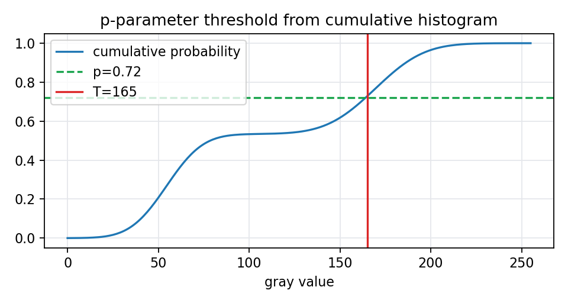

# 6.1.1 p-参数法

> [!note] 书中对应页
> PDF 页码：112
> 打开原页（Obsidian）：[[raw/books/数字图像处理基础_朱虹.pdf#page=112]]
>
> GitHub 公开仓库不随附原书 PDF；下载仓库后，将有权使用的同名 PDF 放入 `raw/books/`，下面的 Obsidian 本地内嵌预览才会显示。
> ![[raw/books/数字图像处理基础_朱虹.pdf#page=112]]

## 来源与状态

- 书名：数字图像处理基础
- 作者：朱虹
- 章节：第 6 章 图像的分割
- 小节：6.1.1 p-参数法
- 书中页码：需人工复核
- PDF 页码：需人工复核
- 本地 PDF：raw/books/数字图像处理基础_朱虹.pdf
- 处理状态：已精修 / 需人工复核

## 核心概念

p-参数法利用目标或背景所占面积比例的先验信息确定阈值。若已知目标大约占图像 p 的比例，就可以在累计直方图上找到对应分位点作为阈值。

## 关键公式

- 累计概率：\(P(t)=\sum_{i=0}^{t}h(i)\)。
- 若目标占比已知，可取满足 \(P(T)\approx p\) 的灰度作为阈值，方向需按目标亮暗人工判断。

## 算法步骤

1. 统计归一化直方图。
2. 计算累计概率。
3. 根据目标或背景面积比例 p 找到阈值。
4. 执行二值化。

## 直观理解

如果你知道背景大约占 70%，那就可以把灰度从暗到亮累计到 70% 的位置当作分界线。

## 使用场景

目标面积比例比较稳定的工业检测、固定拍摄场景下的批量分割。

## 优点

- 利用先验面积信息，计算简单。
- 比手工试阈值更可复现。

## 局限性

- p 估计错误会直接导致分割偏差。
- 目标亮暗方向和直方图重叠需要人工判断。

## 和相关方法的对比

- p-参数法 vs Otsu：p-参数法依赖面积先验，Otsu 依赖类间方差最大化。
- p-参数法 vs 最大熵：前者关心比例，后者关心两类信息量。

## 教学图示

## 对应代码

[threshold_segmentation.py](../../examples/06_image_segmentation/threshold_segmentation.py)

## 相关知识
- [[06_图像的分割/6.1_阈值分割方法|阈值分割方法]]

- [[06_图像的分割/6.1.3_最大类间、类内方差比法|最大类间、类内方差比法]]

## 复习问题

1. p-参数法需要什么先验？
2. 如果目标面积比例变化很大，会发生什么？
3. 如何判断阈值应取累计概率的哪一侧？
