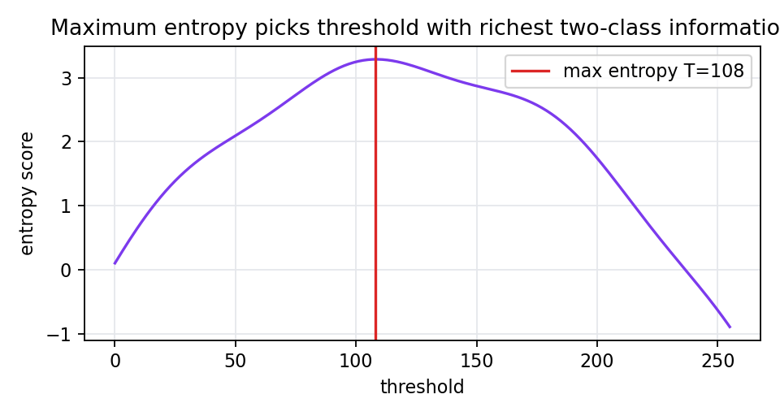

# 6.1.2 最大熵方法

> [!note] 书中对应页
> PDF 页码：112
> 打开原页（Obsidian）：[[raw/books/数字图像处理基础_朱虹.pdf#page=112]]
>
> GitHub 公开仓库不随附原书 PDF；下载仓库后，将有权使用的同名 PDF 放入 `raw/books/`，下面的 Obsidian 本地内嵌预览才会显示。
> ![[raw/books/数字图像处理基础_朱虹.pdf#page=112]]

## 来源与状态

- 书名：数字图像处理基础
- 作者：朱虹
- 章节：第 6 章 图像的分割
- 小节：6.1.2 最大熵方法
- 书中页码：需人工复核
- PDF 页码：需人工复核
- 本地 PDF：raw/books/数字图像处理基础_朱虹.pdf
- 处理状态：已精修 / 需人工复核

## 核心概念

最大熵阈值法把阈值两侧看成两个灰度类别，选择使两类灰度分布信息量之和最大的阈值。它适合从直方图统计角度寻找最能解释目标和背景的分界。

## 关键公式

- 背景熵：\(H_0(t)=-\sum_{i=0}^{t}p_i/P_0\log(p_i/P_0)\)。
- 目标熵：\(H_1(t)=-\sum_{i=t+1}^{L-1}p_i/P_1\log(p_i/P_1)\)。
- 选择：\(T=\arg\max_t(H_0(t)+H_1(t))\)。

## 算法步骤

1. 统计灰度概率。
2. 枚举候选阈值。
3. 分别计算阈值两侧的归一化熵。
4. 选择总熵最大的阈值。
5. 用该阈值二值化。

## 直观理解

好的阈值会让两边都保留足够的灰度结构信息，而不是把一边压成几乎没有内容的空类。

## 使用场景

直方图双峰不明显但两类灰度分布仍有统计差异的图像。

## 优点

- 不需要目标面积先验。
- 能从信息量角度自动选阈值。

## 局限性

- 对噪声和直方图估计敏感。
- 当两类灰度严重重叠时仍会失败。

## 和相关方法的对比

- 最大熵 vs Otsu：最大熵最大化信息量，Otsu 最大化类间差异。
- 最大熵 vs p-参数法：最大熵不需要先验面积比例。

## 教学图示

## 对应代码

[max_entropy_threshold.py](../../examples/06_image_segmentation/max_entropy_threshold.py)

## 相关知识

- [[06_图像的分割/6.1_阈值分割方法|阈值分割方法]]
- [[06_图像的分割/6.1.3_最大类间、类内方差比法|Otsu 方法]]

## 复习问题

1. 最大熵方法为什么要分别计算两类熵？
2. 概率为零的灰度级在实现中如何处理？
3. 最大熵和 Otsu 选阈值的目标函数有什么差异？
