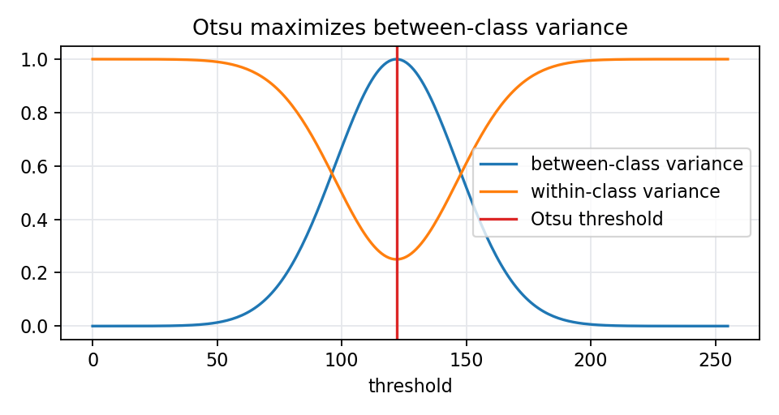

# 6.1.3 最大类间、类内方差比法

> [!note] 书中对应页
> PDF 页码：112
> 打开原页（Obsidian）：[[raw/books/数字图像处理基础_朱虹.pdf#page=112]]
>
> GitHub 公开仓库不随附原书 PDF；下载仓库后，将有权使用的同名 PDF 放入 `raw/books/`，下面的 Obsidian 本地内嵌预览才会显示。
> ![[raw/books/数字图像处理基础_朱虹.pdf#page=112]]

## 来源与状态

- 书名：数字图像处理基础
- 作者：朱虹
- 章节：第 6 章 图像的分割
- 小节：6.1.3 最大类间、类内方差比法
- 书中页码：需人工复核
- PDF 页码：需人工复核
- 本地 PDF：raw/books/数字图像处理基础_朱虹.pdf
- 处理状态：已精修 / 需人工复核

## 核心概念

最大类间方差法通常称为 Otsu 方法。它枚举阈值，寻找让背景和目标均值差异最大、类内波动相对较小的阈值。

## 关键公式

- 类间方差：\(\sigma_b^2(t)=\omega_0(t)\omega_1(t)[\mu_0(t)-\mu_1(t)]^2\)。
- 选择：\(T=\arg\max_t\sigma_b^2(t)\)。
- 类内方差比形式与原书符号需人工复核。

## 算法步骤

1. 统计直方图概率。
2. 枚举阈值并计算两类权重和均值。
3. 计算类间方差或类内/类间方差比。
4. 选择最优阈值并二值化。

## 直观理解

Otsu 想找一个分界，让分出来的两组像素均值离得尽量远，同时每组内部尽量集中。

## 使用场景

背景和目标灰度分布接近双峰、照明较稳定的自动二值化任务。

## 优点

- 无需手工阈值。
- 实现成熟，OpenCV 直接支持。
- 对双峰直方图效果好。

## 局限性

- 不适合严重光照不均。
- 目标很小或类比例极端时可能偏向大类。

## 和相关方法的对比

- Otsu vs 最大熵：Otsu 关注均值分离，最大熵关注信息量。
- Otsu vs p-参数法：Otsu 自动统计，p-参数法依赖面积先验。

## 教学图示

## 对应代码

[otsu_threshold.py](../../examples/06_image_segmentation/otsu_threshold.py)

## 相关知识

- [[06_图像的分割/6.1.2_最大熵方法|最大熵方法]]
- [[07_二值图像处理|二值图像处理]]

## 复习问题

1. Otsu 为什么适合双峰直方图？
2. 目标面积很小时 Otsu 会有什么偏差？
3. 类间方差最大化和类内方差最小化是什么关系？
