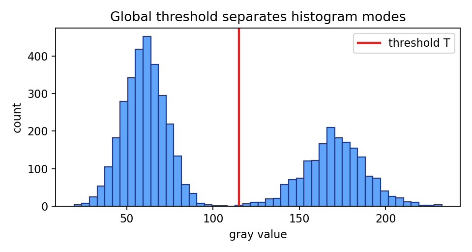

# 6.1 阈值分割方法

> [!note] 书中对应页
> PDF 页码：112
> 打开原页（Obsidian）：[[raw/books/数字图像处理基础_朱虹.pdf#page=112]]
>
> GitHub 公开仓库不随附原书 PDF；下载仓库后，将有权使用的同名 PDF 放入 `raw/books/`，下面的 Obsidian 本地内嵌预览才会显示。
> ![[raw/books/数字图像处理基础_朱虹.pdf#page=112]]

## 来源与状态

- 书名：数字图像处理基础
- 作者：朱虹
- 章节：第 6 章 图像的分割
- 小节：6.1 阈值分割方法
- 书中页码：需人工复核
- PDF 页码：需人工复核
- 本地 PDF：raw/books/数字图像处理基础_朱虹.pdf
- 处理状态：已精修 / 需人工复核

## 核心概念

阈值分割把灰度图像按一个或多个阈值划分为目标和背景。它隐含的前提是目标与背景在灰度分布上有可分性，例如直方图出现双峰或目标灰度稳定高于背景。

## 关键公式

- 二值分割：\(g(x,y)=1\) if \(f(x,y)\ge T\)，否则 \(g(x,y)=0\)。
- 多阈值可写为：\(g=k\) if \(T_k\le f(x,y)<T_{k+1}\)。

## 算法步骤

1. 输入灰度图。
2. 分析直方图或先验目标比例。
3. 选择阈值 \(T\)。
4. 逐像素比较并输出二值图。
5. 可用形态学处理修补小孔和孤立点。

## 直观理解

阈值像一道灰度分界线：比分界线亮的归一类，比它暗的归另一类。

## 使用场景

文档二值化、背景单一的目标提取、工业检测中亮暗差明显的缺陷分割。

## 优点

- 实现简单、速度快。
- 结果容易解释。
- 适合作为复杂分割方法的基线。

## 局限性

- 光照不均或灰度重叠时效果差。
- 只考虑灰度，不考虑空间连通性。

## 和相关方法的对比

- 阈值分割 vs [[06_图像的分割/6.2_区域生长分割方法|区域生长]]：前者按灰度全局分类，后者从种子出发利用连通性。
- 阈值分割 vs [[05_图像锐化/5.5_Canny算子|Canny]]：前者输出区域，后者输出边缘。

## 教学图示

## 对应代码

[threshold_segmentation.py](../../examples/06_image_segmentation/threshold_segmentation.py)

## 相关知识

- [[06_图像的分割/6.1.2_最大熵方法|最大熵方法]]
- [[06_图像的分割/6.1.3_最大类间、类内方差比法|Otsu 方法]]
- [[07_二值图像处理|二值图像处理]]

## 复习问题

1. 什么情况下全局阈值分割容易成功？
2. 为什么光照不均会破坏阈值分割？
3. 阈值分割和边缘检测的输出有什么不同？
