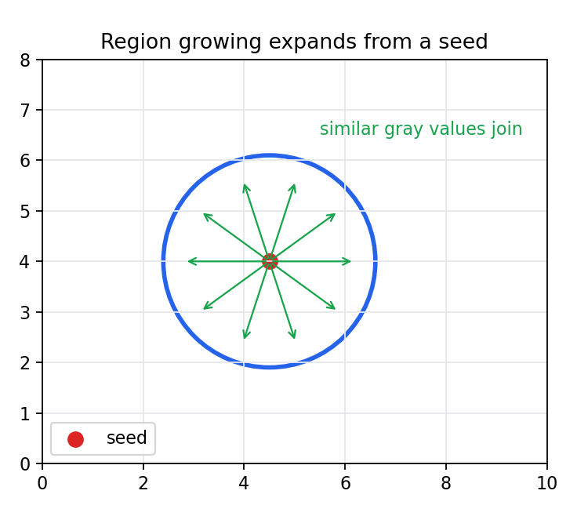

# 6.x 习题

> [!note] 书中对应页
> PDF 页码：112
> 打开原页（Obsidian）：[[raw/books/数字图像处理基础_朱虹.pdf#page=112]]
>
> GitHub 公开仓库不随附原书 PDF；下载仓库后，将有权使用的同名 PDF 放入 `raw/books/`，下面的 Obsidian 本地内嵌预览才会显示。
> ![[raw/books/数字图像处理基础_朱虹.pdf#page=112]]

## 来源与状态

- 书名：数字图像处理基础
- 作者：朱虹
- 章节：第 6 章 图像的分割
- 小节：6.x 习题
- 书中页码：需人工复核
- PDF 页码：需人工复核
- 本地 PDF：raw/books/数字图像处理基础_朱虹.pdf
- 处理状态：已精修 / 需人工复核

## 核心概念

本章习题应围绕阈值选择依据、目标/背景统计差异、空间连通性和参数敏感性展开。重点不是背算法名，而是判断图像条件是否满足算法假设。

## 关键公式

- 复习重点：二值阈值函数、累计概率、最大熵目标、Otsu 类间方差、区域生长相似性准则。

## 算法步骤

1. 先判断图像是灰度可分还是区域连通更重要。
2. 若灰度可分，选择 p-参数、最大熵或 Otsu。
3. 若需要连通区域，考虑区域生长。
4. 说明参数如何影响欠分割或过分割。

## 直观理解

分割题先问“我要的是一条边、一块区域，还是目标/背景标签？”答案不同，方法也不同。

## 使用场景

期末复习、实验报告、参数调试记录、后续二值图像处理前置步骤。

## 优点

- 把阈值、区域和后处理串起来。
- 便于为第 7 章二值图像处理打基础。

## 局限性

- 页码、原书题号和部分符号仍需人工复核。

## 和相关方法的对比

- Otsu、最大熵和 p-参数法适合比较阈值目标函数。
- 阈值分割和区域生长适合比较灰度统计与空间连通性。

## 教学图示

## 对应代码

本节偏复习整合，无单独代码；可结合本章其他示例运行。

## 相关知识
- [[06_图像的分割/6.1_阈值分割方法|阈值分割方法]]

- [[06_图像的分割/6.2_区域生长分割方法|区域生长分割方法]]
- [[07_二值图像处理|二值图像处理]]

## 复习问题

1. 设计一个光照不均图像的分割方案。
2. 比较最大熵和 Otsu 的阈值选择目标。
3. 区域生长的种子点选错会怎样？
4. 为什么分割后常接二值形态学处理？
