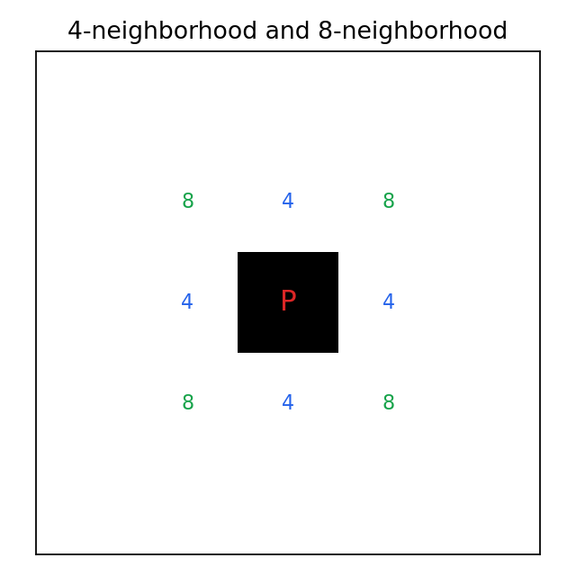

# 7.1.1 连接与点特性

> [!note] 书中对应页
> PDF 页码：130
> 打开原页（Obsidian）：[[raw/books/数字图像处理基础_朱虹.pdf#page=130]]
>
> GitHub 公开仓库不随附原书 PDF；下载仓库后，将有权使用的同名 PDF 放入 `raw/books/`，下面的 Obsidian 本地内嵌预览才会显示。
> ![[raw/books/数字图像处理基础_朱虹.pdf#page=130]]

## 来源与状态

- 书名：数字图像处理基础
- 作者：朱虹
- 章节：第 7 章 二值图像处理
- 小节：7.1.1 连接与点特性
- 书中页码：需人工复核
- PDF 页码：需人工复核
- 本地 PDF：raw/books/数字图像处理基础_朱虹.pdf
- 处理状态：已精修 / 需人工复核

## 核心概念

连接性决定哪些前景点属于同一目标。点特性关注端点、连接点、孤立点和边界点，是细线化和目标分析的基础。

## 关键公式

- 若两点之间存在由邻接前景点组成的路径，则两点连通。

## 算法步骤

1. 输入二值图像。
2. 确定前景、背景和邻接规则。
3. 按结构元素或连通性规则处理前景点集。
4. 输出清理后的二值图、标签图或骨架图。

## 直观理解

二值处理像在黑白剪影上做几何操作：有时收缩、有时扩张、有时编号、有时抽出中心线。

## 使用场景

文档处理、目标计数、缺陷检测、OCR 前处理、医学区域测量。

## 优点

- 计算快，结果清晰。
- 适合做形状统计和后处理。

## 局限性

- 强依赖分割质量。
- 结构元素和连通规则选错会改变拓扑。

## 和相关方法的对比

- 连接与点特性 vs 连通域标记：前者定义规则，后者按规则给区域编号。

## 教学图示

## 对应代码

本节偏概念复习，无单独代码；可结合本章其他示例运行。

## 相关知识

- [[06_图像的分割/6.1_阈值分割方法|阈值分割方法]]
- [[07_二值图像处理/7.2_腐蚀与膨胀|腐蚀与膨胀]]
- [[07_二值图像处理/7.4_贴标签|贴标签]]

## 复习问题

1. 端点和分叉点在骨架分析中有什么意义？
2. 本节操作会如何改变前景区域的面积或连通性？
3. 结构元素或邻接规则选错会带来什么后果？
