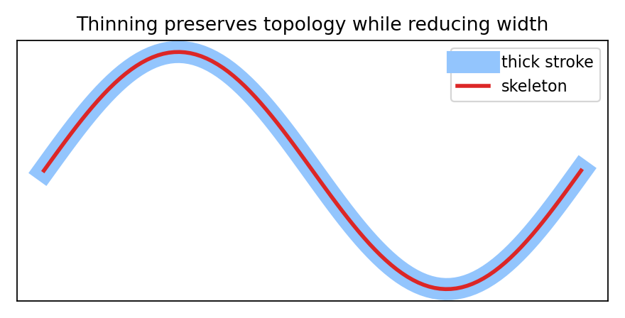

# 7.x 习题

> [!note] 书中对应页
> PDF 页码：130
> 打开原页（Obsidian）：[[raw/books/数字图像处理基础_朱虹.pdf#page=130]]
>
> GitHub 公开仓库不随附原书 PDF；下载仓库后，将有权使用的同名 PDF 放入 `raw/books/`，下面的 Obsidian 本地内嵌预览才会显示。
> ![[raw/books/数字图像处理基础_朱虹.pdf#page=130]]

## 来源与状态

- 书名：数字图像处理基础
- 作者：朱虹
- 章节：第 7 章 二值图像处理
- 小节：7.x 习题
- 书中页码：需人工复核
- PDF 页码：需人工复核
- 本地 PDF：raw/books/数字图像处理基础_朱虹.pdf
- 处理状态：已精修 / 需人工复核

## 核心概念

本章习题应围绕邻接规则、结构元素、形态学组合、标签统计和骨架保持展开，重点是解释操作为何改变二值结构。

## 关键公式

- 复习重点：4/8 邻域、腐蚀、膨胀、开闭运算、标签图、细线化。

## 算法步骤

1. 输入二值图像。
2. 确定前景、背景和邻接规则。
3. 按结构元素或连通性规则处理前景点集。
4. 输出清理后的二值图、标签图或骨架图。

## 直观理解

二值处理像在黑白剪影上做几何操作：有时收缩、有时扩张、有时编号、有时抽出中心线。

## 使用场景

文档处理、目标计数、缺陷检测、OCR 前处理、医学区域测量。

## 优点

- 计算快，结果清晰。
- 适合做形状统计和后处理。

## 局限性

- 强依赖分割质量。
- 结构元素和连通规则选错会改变拓扑。

## 和相关方法的对比

- 形态学后处理 vs 分割：分割产生二值结果，形态学修正其结构。

## 教学图示

## 对应代码

本节偏概念复习，无单独代码；可结合本章其他示例运行。

## 相关知识

- [[07_二值图像处理/7.1_二值图像中的基本概念|7.1_二值图像中的基本概念]]
- [[07_二值图像处理/7.2_腐蚀与膨胀|7.2_腐蚀与膨胀]]
- [[07_二值图像处理/7.3_开运算与闭运算|7.3_开运算与闭运算]]

## 复习问题

1. 给定带小孔和小噪点的二值图，应如何组合开闭运算？
2. 本节操作会如何改变前景区域的面积或连通性？
3. 结构元素或邻接规则选错会带来什么后果？
