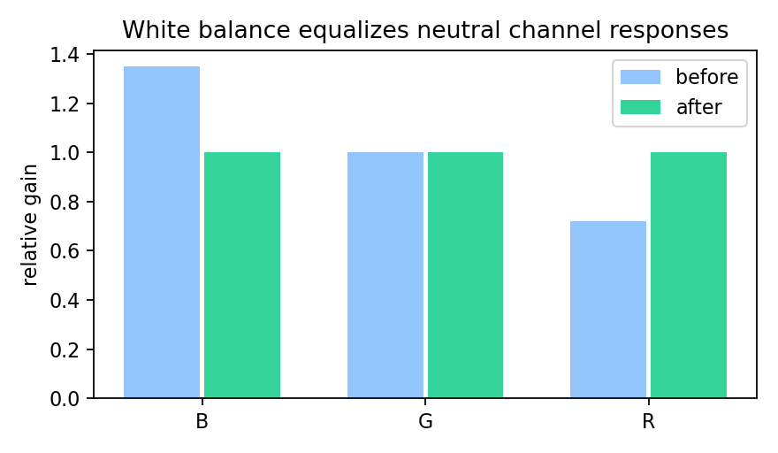

# 8.3 色彩平衡

> [!note] 书中对应页
> PDF 页码：150
> 打开原页（Obsidian）：[[raw/books/数字图像处理基础_朱虹.pdf#page=150]]
>
> GitHub 公开仓库不随附原书 PDF；下载仓库后，将有权使用的同名 PDF 放入 `raw/books/`，下面的 Obsidian 本地内嵌预览才会显示。
> ![[raw/books/数字图像处理基础_朱虹.pdf#page=150]]

## 来源与状态

- 书名：数字图像处理基础
- 作者：朱虹
- 章节：第 8 章 彩色图像处理
- 小节：8.3 色彩平衡
- 书中页码：需人工复核
- PDF 页码：需人工复核
- 本地 PDF：raw/books/数字图像处理基础_朱虹.pdf
- 处理状态：已精修 / 需人工复核

## 核心概念

色彩平衡的目标是消除光源或设备造成的整体色偏，让中性物体恢复接近灰色或白色。它通常通过调整各通道增益实现。

## 关键公式

- 通道增益校正：\(I'_k=\alpha_k I_k\)。
- 理想中性目标满足：\(R'\approx G'\approx B'\)。

## 算法步骤

1. 输入彩色图像。
2. 选择颜色空间或通道校正目标。
3. 估计变换矩阵、通道增益或颜色统计量。
4. 对各通道执行变换并裁剪到合法范围。
5. 观察色偏、亮度和饱和度是否符合任务需求。

## 直观理解

彩色处理不是只调亮暗，而是在多个通道之间重新分配颜色信息；换颜色空间像换一套坐标轴，白平衡和补偿像重新校准各通道的刻度。

## 使用场景

相机白平衡、工业颜色检测、医学彩色图像校正、低质照片修复、颜色分割前处理。

## 优点

- 能保留或恢复颜色语义。
- 便于分离亮度、色调和设备通道误差。

## 局限性

- 色彩校正依赖光源、设备和场景假设。
- 过度补偿可能造成偏色、饱和或肤色失真。

## 和相关方法的对比

- 色彩平衡 vs 彩色补偿：色彩平衡多针对全局色偏，补偿可针对特定通道或场景误差。

## 教学图示

## 对应代码

[white_balance.py](../../examples/08_color_image_processing/white_balance.py)

## 相关知识

- [[02_图像增强/2.7_伪彩色|伪彩色]]
- [[06_图像的分割/6.1_阈值分割方法|阈值分割方法]]
- [[08_彩色图像处理/8.3_色彩平衡|色彩平衡]]

## 复习问题

1. 如何判断一张图存在全局色偏？
2. 本节方法依赖什么颜色或场景假设？
3. 如果输入图像已经饱和，颜色校正会遇到什么限制？
