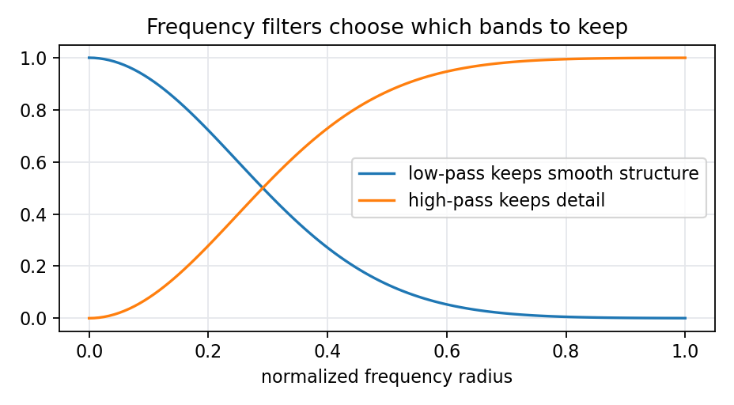

# 9.1.3 快速傅里叶变换（FFT）

> [!note] 书中对应页
> PDF 页码：170
> 打开原页（Obsidian）：[[raw/books/数字图像处理基础_朱虹.pdf#page=170]]
>
> GitHub 公开仓库不随附原书 PDF；下载仓库后，将有权使用的同名 PDF 放入 `raw/books/`，下面的 Obsidian 本地内嵌预览才会显示。
> ![[raw/books/数字图像处理基础_朱虹.pdf#page=170]]

## 来源与状态

- 书名：数字图像处理基础
- 作者：朱虹
- 章节：第 9 章 图像变换
- 小节：9.1.3 快速傅里叶变换（FFT）
- 书中页码：需人工复核
- PDF 页码：需人工复核
- 本地 PDF：raw/books/数字图像处理基础_朱虹.pdf
- 处理状态：已精修 / 需人工复核

## 核心概念

FFT 是傅里叶变换的快速算法，把直接计算的高复杂度降下来，使频域处理能够用于较大图像。

## 关键公式

- \(O(N^2)\) 的 DFT 可由 FFT 降为约 \(O(N\log N)\)。
- 公式符号、归一化系数和边界处理需对照原书人工复核。

## 算法步骤

1. 输入灰度图像或一维灰度序列。
2. 选择傅里叶或小波变换。
3. 将图像映射到频率/尺度系数域。
4. 可视化、筛选、增强、阈值化或压缩系数。
5. 需要图像结果时执行逆变换或归一化显示。

## 直观理解

变换不是改变图像本身，而是换一个角度观察图像：傅里叶看全局频率，小波看不同尺度和位置上的细节。

## 使用场景

频域滤波、周期噪声分析、图像压缩、融合、增强、小波去噪和多尺度特征提取。

## 优点

- 能解释空间域难以直接观察的频率或尺度结构。
- 便于针对不同频带或子带做处理。

## 局限性

- 变换系数不如像素直观。
- 边界、归一化和阈值选择会影响结果。

## 和相关方法的对比

- FFT vs DFT：数学结果等价，FFT 是高效计算方法。

## 教学图示

## 对应代码

[two_dimensional_fft.py](../../examples/09_image_transform/two_dimensional_fft.py)

## 相关知识

- [[04_图像去噪/4.5_非局部均值滤波|非局部均值滤波]]
- [[05_图像锐化/5.3_二阶微分算子|二阶微分算子]]
- [[10_图像压缩编码|图像压缩编码]]

## 复习问题

1. 本节方法把图像映射到了什么表示域？
2. 低频、高频或小波子带分别对应什么图像结构？
3. 参数或阈值选错会产生什么影响？
