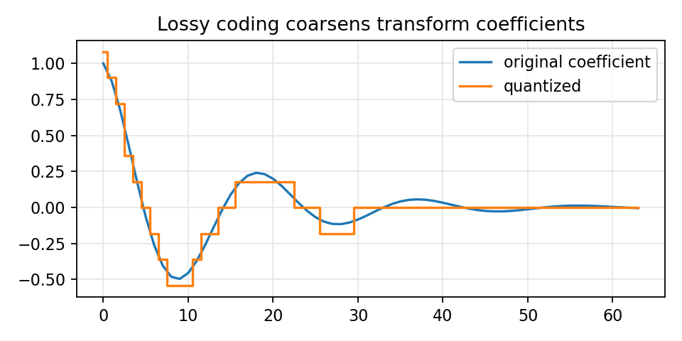

# 10.3.1 彩色图像的有损编码

> [!note] 书中对应页
> PDF 页码：195
> 打开原页（Obsidian）：[[raw/books/数字图像处理基础_朱虹.pdf#page=195]]
>
> GitHub 公开仓库不随附原书 PDF；下载仓库后，将有权使用的同名 PDF 放入 `raw/books/`，下面的 Obsidian 本地内嵌预览才会显示。
> ![[raw/books/数字图像处理基础_朱虹.pdf#page=195]]

## 来源与状态

- 书名：数字图像处理基础
- 作者：朱虹
- 章节：第 10 章 图像压缩编码
- 小节：10.3.1 彩色图像的有损编码
- 书中页码：需人工复核
- PDF 页码：需人工复核
- 本地 PDF：raw/books/数字图像处理基础_朱虹.pdf
- 处理状态：已精修 / 需人工复核

## 核心概念

彩色有损编码常利用人眼对亮度更敏感、对色度相对不敏感的特点，将亮度和色度分开处理，并对色度更强压缩。

## 关键公式

- 可抽象为：\(RGB\rightarrow YCbCr\rightarrow\) 色度下采样/量化。
- 公式符号、比特计数和码字约定需对照原书人工复核。

## 算法步骤

1. 分析图像中的冗余或可容忍失真。
2. 选择无损编码或有损编码策略。
3. 对像素、符号或变换系数进行预测、变换、量化或熵编码。
4. 记录压缩率、失真和可逆性。
5. 解码或重构图像并检查质量。

## 直观理解

压缩是在问“哪些信息必须精确保存，哪些信息可以更短地写，哪些误差可以接受”。

## 使用场景

文档和标签图无损存储、照片有损压缩、传输带宽受限的图像编码、渐进式图像浏览。

## 优点

- 能显著降低存储和传输成本。
- 可按任务选择无损或有损方案。

## 局限性

- 有损压缩会引入不可逆失真。
- 无损压缩率受图像冗余程度限制。

## 和相关方法的对比

- 彩色有损编码 vs 白平衡：前者压缩表示，后者校正色偏。

## 教学图示

## 对应代码

[jpeg_idea_demo.py](../../examples/10_image_compression/jpeg_idea_demo.py)

## 相关知识

- [[08_彩色图像处理/8.2_表色系|表色系]]

## 复习问题

1. 本节方法利用了哪一种冗余？
2. 它是无损还是有损？为什么？
3. 什么图像条件下该方法压缩效果会变差？
