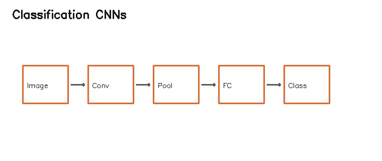

# 11.3 图像分类深度卷积网络

> [!note] 书中对应页
> PDF 页码：220
> 打开原页（Obsidian）：[[raw/books/数字图像处理基础_朱虹.pdf#page=220]]
>
> GitHub 公开仓库不随附原书 PDF；下载仓库后，将有权使用的同名 PDF 放入 `raw/books/`，下面的 Obsidian 本地内嵌预览才会显示。
> ![[raw/books/数字图像处理基础_朱虹.pdf#page=220]]

## 来源与状态

- 书名：数字图像处理基础
- 作者：朱虹
- 章节：第 11 章 深度学习与图像处理
- 小节：11.3 图像分类深度卷积网络
- 书中页码：需人工复核
- PDF 页码：需人工复核
- 本地 PDF：raw/books/数字图像处理基础_朱虹.pdf
- 处理状态：已精修 / 需人工复核

## 核心概念

图像分类网络把图像映射为类别概率，通常由特征提取骨干和分类头组成。

## 关键公式

- \(p=softmax(z)\)
- 网络结构、损失函数和符号需对照原书人工复核。

## 算法步骤

1. 明确任务：分类、超分辨率或目标检测。
2. 选择网络模块和输入输出格式。
3. 前向传播提取层级特征。
4. 用损失函数衡量预测和标注差异。
5. 训练或推理后解释输出结果。

## 直观理解

深度网络像一组可学习的图像处理流水线：浅层看边缘和纹理，深层组合成目标、类别或重建细节。

## 使用场景

图像分类、超分辨率重建、目标检测、视觉质检、医学影像辅助分析。

## 优点

- 能从数据中学习复杂特征。
- 可端到端优化任务目标。

## 局限性

- 依赖数据、算力和训练配置。
- 可解释性弱，部署时需关注模型大小和推理速度。

## 和相关方法的对比

- 分类网络 vs 检测网络：分类给整图类别，检测还要定位目标。

## 教学图示

## 对应代码

[lenet5_structure_demo.py](../../examples/11_deep_learning_image_processing/lenet5_structure_demo.py)

## 相关知识

- [[05_图像锐化/5.2_一阶微分算子|一阶微分算子]]
- [[06_图像的分割/6.1_阈值分割方法|图像分割]]
- [[09_图像变换/9.2_小波变换|小波变换]]

## 复习问题

1. 本节网络或层解决什么任务？
2. 输入、输出和关键参数分别是什么？
3. 它与对应传统图像处理方法有什么区别？
